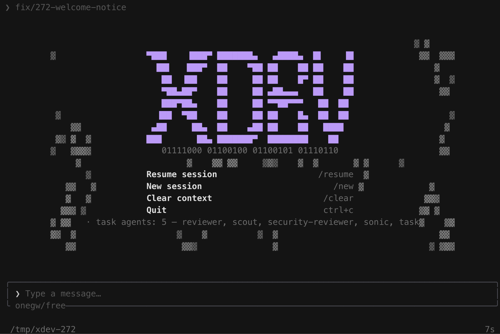

<p align="center">
  
</p>

<p align="center">
  A lightweight coding agent in Go: one static, CGO-free binary that reads your repo, edits it, runs it, and remembers the session.
</p>

<p align="center">
  <a href="https://github.com/FreePeak/xdev/releases/latest"></a>
  
  <a href="https://go.dev"></a>
  <a href="./LICENSE"></a>
  <a href="./CONTRIBUTING.md"></a>
</p>

<p align="center">
  
</p>

## What it is

`xdev` is a terminal coding agent and a harness you can embed. It carries the
session/chat core of [pi](https://github.com/earendil-works/pi) and Oh My Pi
(omp) — provider streaming, the agent loop, JSONL session persistence, tool
execution, a terminal UI — rebuilt in Go with two disciplines the JS versions
gave up:

- **One binary, ~20–22 MB per platform.** No JS runtime, no in-process plugin
  VM, no install-time toolchain. `CGO_ENABLED=0` cross-builds for linux, macOS
  and windows, each on amd64 and arm64.
- **A hard <100 MB RSS budget.** `debug.SetMemoryLimit` is the backstop
  (`XDEV_MEMLIMIT` overrides it) and every queue, buffer, cache, session window
  and output sink is bounded, so a runaway turn degrades into "compact now"
  instead of an OOM kill.

Sessions are append-only JSONL trees with a mutable leaf pointer. Nothing is
rewritten: branching moves a pointer, context is reconstructed by walking parent
links, and the file stays inspectable with ordinary tools — `jq`, `grep`, git.
The format is omp-compatible (`xdev -from-claude` / `-from-codex` import a
transcript from another harness and continue it).

## Install

**Linux / macOS** — one command. It resolves the newest release for your
platform, verifies its SHA-256 against the release manifest, and installs to
`~/.local/bin`. Re-running it is how you upgrade.

```bash
curl -fsSL https://raw.githubusercontent.com/FreePeak/xdev/main/scripts/install.sh | sh
```

**Windows** — download `xdev_windows_amd64.exe` (or `_arm64`) from
[the latest release](https://github.com/FreePeak/xdev/releases/latest) and put it
on your `PATH`.

**From source** (needs Go 1.25+):

```bash
git clone https://github.com/FreePeak/xdev && cd xdev
CGO_ENABLED=0 go build -o xdev ./cmd/xdev
```

Installer knobs — the same names `xdev update` reads: `XDEV_UPDATE_REPO`,
`XDEV_UPDATE_API`, `XDEV_INSTALL_DIR`.

## First run

```bash
xdev setup      # creates ~/.xdev/agent/, writes a starter config.yml, prints next steps
xdev            # the TUI
```

xdev speaks eight wire formats through `~/.xdev/agent/models.yml` —
`anthropic-messages`, `openai-completions`, `openai-responses`,
`azure-openai-responses`, `openai-codex-responses`, `google-generative-ai`,
`google-vertex`, `gemini-cli` — so any OpenAI-compatible gateway works. Point a
provider at it:

```yaml
# ~/.xdev/agent/models.yml
providers:
  onegw:
    baseUrl: http://127.0.0.1:8080/v1
    apiKey: ${ONEGW_KEY}              # or keychain:dev.xdev.credential.onegw
    api: openai-completions
    models: [{ id: free, name: Free, contextWindow: 1000000 }]
defaultModel: onegw/free
```

Claude Pro/Max and Codex subscriptions work through the browser OAuth flow:

```bash
xdev login claude     # or: xdev login codex
```

Two hundred more hosts — the subscription and gateway providers opencode and omp
list — connect with one command instead of a hand-written block:

```bash
xdev connect                  # the providers a credential is ready to use
xdev connect --list           # the whole catalog (~200 hosts), with its state
xdev connect deepseek         # write that provider into models.yml
xdev connect openrouter --key sk-or-...   # ...and store the key (0600)
```

`/connect` in the TUI opens the same catalog as a picker. Each connected row
keeps its credential as a `${VAR}` reference in models.yml — the variable the
host documents — so the config file stays safe to paste into an issue; a key
passed with `--key` goes to `credentials.json` instead. Every connected
provider turns on model discovery, so hosts publish their own newest ids
without a config edit. The catalog is a generated snapshot of
[models.dev](https://models.dev) (`scripts/gen_connect.go`), and the same
command refreshes nothing at runtime — it answers offline.

## Use it

```bash
xdev                                            # the TUI (a bare call on a TTY)
xdev "add pagination to /users, then run the tests"
xdev -continue "now cover the empty page"       # latest session in this cwd
xdev -resume 01a0 "pick up where we left off"   # by session-id prefix
xdev -model onegw/dev "…"                       # explicit provider/model
xdev < prompt.txt                               # headless: the prompt on stdin
xdev rpc                                        # JSONL-over-stdio, for embedders
xdev acp                                        # ACP server on stdio, for editors
```

`xdev --help` lists every launch flag. The flags an omp user expects
(`-p/-c/-r/-e`, `--approval-mode`, `--smol/--slow/--plan-model`, `--models`,
`--provider`, `--add-dir`, `--no-prewalk`, `--plugin-dir`) are accepted with the
same meanings; [docs/parity-delta.md](docs/parity-delta.md) records every
deliberate difference.

## Terminal UI

The look is Grok CLI's (GrokNight/GrokDay, and 66 named theme tokens you can
remap in JSON with live reload). What matters for daily work:

| Keys | Action |
|---|---|
| `PgUp` / `PgDn`, `Ctrl+B` / `Ctrl+F` | page through the transcript |
| `Home` / `End` | jump to the top / back to live |
| `Shift+↑` / `Shift+↓` | line up / down |
| `↑` / `↓` | walk the composer's visual rows, then recall prompt history |
| `Ctrl+R` | previous prompt |
| `Alt+M` / `Alt+A` / `Alt+T` | model picker / agent hub / session tree |
| `Alt+S` / `Ctrl+T` | context dock: cycle shown/hidden/auto / fold its sections |
| `Ctrl+O` | expand the newest tool result or thinking box |
| `Esc` | idle: clear the draft → `Esc` again brings it back → `Esc` opens the session tree (running: cancels the turn) |
| `Ctrl+C` | quit (`Esc` cancels the running turn first) |

Every chord is remappable in `~/.xdev/agent/keybindings.yml`; `/hotkeys` shows
the live map.

Scrolling never fights the stream: a scrolled viewport stays put while output
arrives, and `▲ n ▼ n` shows how much is hidden. Mouse selection covers the
whole screen and survives a scroll — hold the drag at the transcript's top or
bottom edge and it keeps scrolling while you select, and the right-edge
scrollbar drags like any other. Shift+drag hands the gesture back to the
terminal's native selection.

Thinking renders like a tool result: a rounded box whose top border carries the
state (`⠹ Thinking…` while it streams, `Thought for Xs` when it settles) and
whose body is a fixed 12-row window. The wheel over the box scrolls its own
window, so long reasoning stays readable without pushing the transcript under
the pointer; `Ctrl+O` expands it to every row.

The **context dock** (`Alt+S`) is a fixed 42-column panel right of the
transcript: the pending plan, the task list, the files this session changed, the
running subagents and the session footer — the working set, kept beside the
stream instead of scrolling behind it. It auto-closes below 120 columns, never
takes focus from a picker or a question card, and rebuilds only on events (plan
published, tool finished, agent settled), never per frame. A pending plan is
resolved where plans have always been resolved — `/plan off` approves, any
typed prompt is revision feedback — and `/plan show` reprints the document in
the transcript.

**Slash commands** dispatch at input-submit and never reach the model:

| Command | Action |
|---|---|
| `/new` `/fresh` `/clear` `/drop` | start over, rotate provider state, reset context in place, delete the session file |
| `/resume [id]` `/fork` `/branch` `/tree` | session picker, fork, entry switch, tree navigator |
| `/rename <title>` `/dump` `/export [path]` `/share` `/collab` | title, export to markdown/HTML, share an E2E-encrypted view |
| `/model [@role\|ref]` `/connect [name]` `/theme <name>` `/settings` `/hotkeys` | model, provider catalog, theme and display control (`/settings sidebarMode auto\|show\|hide` pins the dock) |
| `/goal` `/plan` `/prewalk` `/handoff` `/advisor` `/vibe` | run modes: objective + token budget, read-only research, model handoff, background reviewer, director mode |
| `/memory` `/skill:<name>` `/hub` `/tasks` `/join <link>` | knowledge, skills, the subagent roster, background jobs, joining a shared session |
| `/help` `/quit` | every command, and an exit that prints the `--resume` line to get back |

Lifecycle commands refuse while a turn is running. **Custom commands** are
markdown files: drop one in `.xdev/commands/` (project) or
`~/.xdev/agent/commands/` (user; project wins), optionally with `name:` and
`description:` frontmatter, and the body is a prompt template with quote-aware
`$1..$n`, `$@`, `$@[start:length]` and `$ARGUMENTS` expansion. An unknown
`/foo` falls through to the model as ordinary text.

## Tools

Four tools are the core — `read`, `write`, `edit`, `bash` — and they are what
the system-prompt budget is spent on. The rest of the surface is registered but
progressively disclosed: the model sees a one-line index and pulls a schema with
`tool_search` → `tool_describe` → `tool_call`, so the long tail costs almost
nothing per turn.

The rest of the surface: `grep`/`glob` (the host's `rg` is used when present),
`eval` (a persistent Python kernel; a `.ipynb` reads and edits as cell blocks),
`ast_grep`/`ast_edit`, `lsp`, `debug` (DAP over stdio: dlv, debugpy, lldb-dap),
`browser` (CDP attach to a Chrome you started — it never launches one),
`web_search`, `github`, `security_scan`, `computer`, `tts`, `generate_image`,
`checkpoint` / `rewind`, `todo`, `ask`, `task` + `hub` + `send_message` /
`inbox` for subagents and cross-session mail, and the memory and skill tools.
MCP servers and subprocess extensions register into that same registry, so they
ride the same approval policy, hooks and output sinks as the built-ins.

## Configuration & credentials

Everything lives under `~/.xdev/agent/` — `config.yml`, `models.yml`,
`credentials.json`, `sessions/`, `agents/`, `commands/`, `themes/` — layered
schema defaults → user file → `<project>/.xdev/config.yml` → `-config` overlays,
and readable with `xdev config list|get|path`. Only the user layer is editable
through `xdev config set`; project files stay hand-written, because a repository
that can set your settings is how leaks start.

`credentials.json` is written `0600` and **re-verified on every read** — mode
`0600` and `nlink == 1`, because a write-time chmod says nothing about the file
now. A file that fails either check is refused with the repair named, never
silently trusted.

To keep a long-lived token off disk on macOS, store it in the Keychain yourself
and point a provider at it:

```yaml
providers:
  openai:
    apiKey: keychain:dev.xdev.credential.openai/linh   # service[/account]
    api: openai-completions
```

xdev **reads** such an item and never writes one — `/usr/bin/security` accepts a
secret either as an argument (visible in `ps` to every user on the machine) or
through a prompt that silently truncates at 128 bytes. An unsatisfiable
`keychain:` reference is an error naming the reference; xdev will not quietly
use a different credential. `XDEV_DISABLE_KEYCHAIN=1` turns the lookup off.
[Rationale with measurements](docs/decisions/keychain-credential-source.md).

A repository is not a configuration authority: its hooks run only once you trust
the workspace (`xdev trust`). [SECURITY.md](SECURITY.md) is the reporting
policy; the [2026-09-15 audit](docs/SECURITY-AUDIT-2026-09-15.md) is public.

## Updating, checking, measuring

```bash
xdev update --check                  # is a newer release published for this channel?
xdev update                          # verify SHA256SUMS, then replace this binary
xdev update --channel canary         # pre-release tags (v0.2.0-canary.1)
xdev update job install              # a twice-daily release check (launchd / systemd)
xdev update job status               # what it last found, and whether it is installed
xdev bench --turns 5 --model @smol   # TTFT + decode p50/p95 through your provider
xdev stats --serve                   # usage dashboard over the local session store
xdev usage                           # which accounts are configured + what you spent locally
```

`xdev update` resolves the channel's newest release from GitHub
(`XDEV_UPDATE_REPO`, default `FreePeak/xdev`; `XDEV_UPDATE_API` for a mirror),
refuses a release with no `SHA256SUMS` entry, refuses when the running binary is
not writable — printing the exact `chmod u+w <path>` — and installs by writing a
temp file next to the target and renaming, so an interrupted update never leaves
a half-written binary. `--check` only reports.

Keeping up to date is opt-in and costs nothing to notice: `xdev update job
install` registers `com.freepeak.xdev.update-check` (launchd) or a `--user`
systemd timer running `xdev update --check` at 09:00 and 21:00. Each run leaves
one record in the data dir, and the next launch reads it — so a newer release
surfaces as a line on the welcome screen and on `xdev -p`'s stderr, never as a
network call in the way of your prompt. It never installs anything; `xdev
update` stays the act that does. With no job registered, the first
terminal-attached launch of a 12-hour window runs the check detached instead,
and `XDEV_UPDATE_CHECK=0` declines even that. `xdev update job remove`
unregisters it.

Release binaries are Developer ID-signed and notarized in CI when the `APPLE_*`
secrets are configured, and ship ad-hoc signed when they are not: a release
never fails for want of credentials. See
[`.github/workflows/release.yml`](.github/workflows/release.yml) (job
`macos-sign`) for the five secret names.

## Design principles

1. **A minimal prompt.** The budget is under 1,000 tokens including tool
   descriptions. Frontier models are RL-trained to act as coding agents; 10,000
   tokens of instructions are dead weight. Project context arrives through the
   standard `AGENTS.md` hierarchy (global → project, imports included), and the
   whole prompt is user-replaceable.
2. **Four core tools.** `read`, `write`, `edit`, `bash` are the job. Everything
   else has to earn its place in the request.
3. **YOLO by default — no permission theater.** Read-data + execute-code +
   network cannot be contained by prompting or pattern rules. Containment
   belongs to external sandboxing; the harness documents those patterns
   ([container & sandbox reference](docs/reference/container-and-sandbox.md))
   rather than performing security.
4. **Bounded everything.** Backpressure is a feature. Nothing grows silently
   with its input.
5. **Append-only state.** Sessions, transcripts and checkpoints are trees you
   can read; a fork is a pointer, not a copy.
6. **Shell out over import.** `git`, `rg`, `fd`, `ast-grep`, `gh`, `python3`
   and `/usr/bin/security` stay external — optional, probed at setup, never
   required. Six direct Go dependencies in `go.mod`; the binary stays CGO-free.

## How it compares

Seven harnesses were read from primary sources — installed binaries and bundles,
full clones, SQLite stores, live request dumps — and each produced a written
adopt / verify / **reject** verdict in [docs/PRD.md](docs/PRD.md) §5 instead of
imitation. Teardowns: [pi](docs/research/parity-pi-internals.md),
[omp](docs/research/parity-omp-internals.md),
[Claude Code](docs/research/claude-code-internals.md),
[OpenCode](docs/research/opencode-internals.md),
[DeepSeek Harness](docs/research/dsh-internals.md),
[fx](docs/research/fx-internals.md), [hermes](docs/research/hermes-internals.md);
the dispositioned cross-check is
[docs/parity/harness-cross-check-2026-09-14.md](docs/parity/harness-cross-check-2026-09-14.md).

| Peer | Their bet | In xdev | Refused |
|---|---|---|---|
| **pi** | Minimalism as spec: a measured ~460–510-token prompt, four core tools, no permission system, container recipes in docs, no todo tool | The value system, the stream contract, the session model | pi's own refusals: `todo` ships (omp's 9-op engine), and the long tail ships behind disclosure |
| **omp** | Pi's core plus everything: Bun, Rust N-API natives, in-process TS extensions, 29 tools ≈ 12–15k prompt tokens, six compaction paths, hub/subagents, SQLite sidecars | Semantics ported with the same entry names, so sessions interop: the tree store (`message` / `compaction` / `reset_boundary`), the compaction ladder — `snapcompact`/`shake`/`soft` as opt-in members beside the model summarize — task agents + hub, themes, skills, memory | The weight: in-process plugins → subprocess JSONL with a per-event timeout + SIGKILL; natives → `rg`/`fd`/`ast-grep` shell-outs; sidecar accumulation → one tiny rollup file |
| **Claude Code** | A thin layer over the model wrapped in a large product surface: approval modes, Agent Teams, OTel export, enterprise policy tiers | Plan mode with an explicit gate, `ask` (a batch is one card, not N interruptions), checkpoint/rewind, hooks exit-2 blocking, prompt-cache markers on the request prefix | Telemetry (xdev ships none), managed-policy tiers, in-process permission UI, fan-out without depth caps |
| **OpenCode** | SQLite as the source of truth — WAL, migrations, todos as a table — plus an LSP manager that is unconditional on the write path | Its diagnostic, not its code: a bad edit should surface in the same turn. That is #263, still open | Making a database the transcript. JSONL stays the replayable record, and SQLite appears only where a query engine is the point (mnemopi's FTS5 memory store, pure-Go so the binary stays CGO-free) |
| **DeepSeek Harness** | "Everything is a plugin": ~57 renameable model-facing tools, none privileged — even the loop and the adapters are plugins; a *linear* event log with a monotonic `seq` | The tree stays, so `/fork`, `/branch` and `rewind` exist at all; a logged request envelope and ignorable-entry forward-compat are ticketed (#265) | The in-process VM: foreign code must not be able to kill the session or inherit full process trust |
| **fx** (Vercel Labs, Zig) | A tiny native binary that publishes enforceable budgets: 6.17 MiB, a 2 ms boot gate, a 7.800 MiB ceiling, compaction ratios as exact integers | The enforce-the-promise discipline (see the open tickets below), plus the durable-write set and use-time credential verification (#122, #123, closed) and a repo-safe config allowlist stricter than fx's three keys | A linear log, WASM/N-API embedding, PGSO size codegen, and deleting the learning layer to stay small: a peer's absence is evidence of different scope, not of low value |
| **hermes** (Nous Research) | A self-improving loop in a `uv` venv: 45+ tools, a 61,810-char three-tier cache, skills grown from experience, one process serving six chat platforms | Progressive disclosure: the deferred catalog — `tool_search` → `tool_describe` → `tool_call` — is the seam that keeps a wide surface off a small prompt | The venv (one static binary instead), the chat gateway, and self-modifying skills on autoplay |

**The tension, named.** A later directive asked for omp's whole feature surface,
which pulls against pi's minimalism. It resolved mechanically, not
ideologically: the prompt stays small and the four core tools stay the only ones
in the request, while the long tail is registered and *disclosed on demand*. MCP
stays optional for pi's reason — a CLI beats an MCP server when the CLI exists.

**What the comparison did not finish.** "We studied it" is not "xdev shipped
it", so the open half is named here instead of glossed: post-edit LSP
diagnostics on the `edit`/`write` result (#263, OpenCode's cheapest win), the
startup and binary-size gates that would make those promises machine-enforced
rather than prose (#118, #119), the tape-replay tier that turns a user's render
bug into a checked-in golden with no PTY (#120), and `<untrusted_tool_result>`
wrapping of injected web, browser and MCP output — the hermes pattern PRD §5
adopts and the code does not yet do. Hiding that in a section about how well
studied the design was would be this repo's own defect class, in prose.

**The method, in one line.** Primary sources or it didn't happen: a peer claim
without a `path:line` does not enter the plan. The rule caught us as well as the
peers — an audit of the dsh/OpenCode pass found **41 of 85** quoted "verbatim"
spans were paraphrases wearing quotation marks, one cited a file absent from the
corpus, and the correction is recorded in PRD §5.4 rather than quietly amended.

## Repository layout

One binary (`cmd/xdev`), one internal package per concern: `ai` (the wire
adapters + the shared SSE/partial-JSON reader), `agent` (the loop, compaction
ladder, subagents, plan/goal modes, prompt assembly), `session` (the JSONL tree
store), `tool` (the registry, approvals, output sinks), `tui` (the frame-plan
renderer over tcell), `config` (layering + the credential chain), and `dist`
(`setup`/`update`/`bench`). The rest are the seams: `rpc`, `acp`, `protocol`,
`ext`, `mcpclient`, `memory`, `skills`, `rules`, `hooks`, `theme`, `stats`.

## Documentation

| Read | What it answers |
|---|---|
| [docs/PRD.md](docs/PRD.md) | scope, architecture, milestones, status — the source of truth |
| [docs/research/2026-09-09-omp-pi-architecture-go-rebuild.md](docs/research/2026-09-09-omp-pi-architecture-go-rebuild.md) | the architecture research and rebuild blueprint |
| [docs/reference/session-format.md](docs/reference/session-format.md) | the JSONL tree on disk |
| [docs/reference/extension-protocol.md](docs/reference/extension-protocol.md) | the subprocess extension handshake |
| [docs/reference/container-and-sandbox.md](docs/reference/container-and-sandbox.md) | running it contained |
| [docs/parity/cli.md](docs/parity/cli.md) · [docs/parity/tools.md](docs/parity/tools.md) | measured parity against the omp baseline |
| [docs/decisions/](docs/decisions/) | the recorded trade-offs, with evidence |
| [CONTRIBUTING.md](CONTRIBUTING.md) | the checks a PR must pass, and what will not be accepted |

## Status

Milestones M0–M15 are landed (2026-09-09 → 2026-09-12): the provider layer and
its eight transports, the session core, the agent loop and four tools, the TUI,
compaction and failover, RPC + subagents + MCP, the memory-hardening audit
(fuzzers, six-platform cross-builds), model roles and auth, session UX, the
agent system (task agents, hub, hooks, advisor, prewalk, plan mode), memory and
skills, the extended tool set, and the v2 modes (vibe, collab, ACP, profiles,
`/export` + `/share`, goal mode). The distribution surface — the installer,
`xdev update` and the release pipeline — closed on 2026-09-14. 553 Go files,
274 of them tests, ~159k lines.

What ships is [the release list](https://github.com/FreePeak/xdev/releases).
What is left is tracked in GitHub issues — this repo has no `TODO.md`, and the
[PRD](docs/PRD.md) milestone table is the status summary.

## Contributing

Start with [CONTRIBUTING.md](CONTRIBUTING.md). Issues are the task list; every
PR says what changed and why. There is deliberately no CI gate on a pull
request — you run the checks yourself before merging: `gofmt -l .`,
`go vet ./...`, `go test -count=1 ./...`, `go test -race -count=1 ./...`, and
the six-platform `CGO_ENABLED=0` cross matrix. Agent-authored PRs are welcome
and hold to the same bar: the human who submits owns every line.

## License

Apache-2.0 — see [LICENSE](LICENSE). Code of conduct:
[CODE_OF_CONDUCT.md](CODE_OF_CONDUCT.md). Security reporting:
[SECURITY.md](SECURITY.md).

<details>
<summary>The name</summary>

The repository and product name is **xdev**. The research document that
preceded it explored the working codename **adze** — a small, sharp woodworking
adze: light, precise, fast, cutting exactly what you point it at. That proposal
is superseded by the repository name.

</details>
