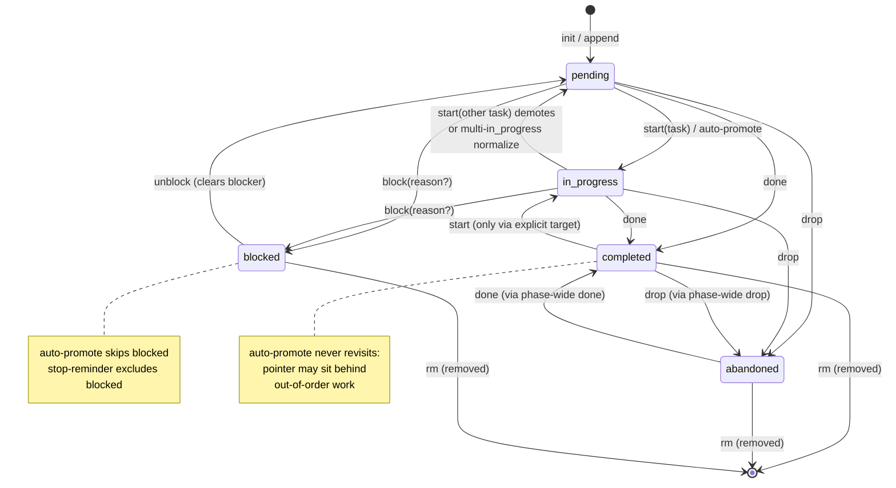

# omp todos internals — the `todo` tool, task engine, and lifecycle (primary-source deep dive)

*Researched 2026-09-09 against omp `@oh-my-pi/pi-coding-agent@18.0.7` (installed at
`~/node_modules/@oh-my-pi/pi-coding-agent/`, shim `~/.bun/bin/omp` → `dist/cli.js`, Bun-compiled
binary whose bundle preserves source file comments and ships `src/` + prompt markdowns in-package),
the live `~/.omp/agent/agent.db`, real session JSONLs under `~/.omp/agent/sessions/`, and the
shipped harness doc readable at `omp://docs/tools/todo.md`.*

---

## 0. Deltas vs existing research docs

| Existing claim | Verdict | Evidence |
|---|---|---|
| `2026-09-09-omp-pi-architecture-go-rebuild.md` §I: pi principle 4 — "**No built-in todos**: models get confused by tool-tracked state; task lists belong in files (TODO.md)" | **SUPERSEDED for omp** (still true for pi upstream). omp v18 ships a full `todo` tool: phased lists, 5 statuses, an auto-promotion engine, a stop-time reminder loop, eager first-turn forcing, a `/todo` user command, and RPC exposure. pi `@earendil-works/pi-coding-agent` (installed 0.85.0) still has **no** todo tool (`dist/core/tools/` has no todo file; verified). | `src/tools/todo.ts` (1,273 lines), `src/session/todo-tracker.ts` (391 lines), `src/modes/controllers/todo-command-controller.ts` (474 lines), shipped `docs/tools/todo.md` |
| `docs/PRD.md` §5.1 "Verify: TodoWrite-as-tool vs omp's file-based TODO.md — keep the file approach" | **The premise changed.** omp's production answer is neither a file nor a DB: canonical todo state lives **in the session transcript** (tool-result `details.phases`), mirrored into an in-memory `TodoTracker`, with `user_todo_edit` custom entries only for user edits. No `agent.db` table exists for todos (verified: `sqlite3 agent.db` has no `task*`/`todo*` table — only `threads`, `meta`, usage/auth tables). | SQLite schema dump 2026-09-09; `src/cursor.ts` comment: "its `toolResult` (carrying `details.phases`) lands in the branch, which `#syncTodoPhasesFromBranch` replays" |
| `claude-code-internals.md`: TodoWrite state at `~/.claude/tasks/<session-uuid>/N.json` | **CONFIRMED live**, richer shape than documented: `{id, subject, description, activeForm, status: pending\|in_progress\|completed\|deleted, blocks[], blockedBy[]}` (real file quoted below). Binary also embeds a second status enum `["pending","in_progress","completed"]` (the TodoWrite-era schema) vs `deleted` in the newer Task* family. | `~/.claude/tasks/007c9aef…/1.json`; `strings ~/.local/bin/claude` |
| `opencode-internals.md` §2.5 todowrite | **CONFIRMED + corrected**: schema is `Info = {content, status: pending\|in_progress\|completed\|cancelled, priority: high\|medium\|low}` (server `SessionTodo.Info`, `q.Struct` in `~/.opencode/bin/opencode` @68016000). No phases, no blocked state, no engine: the model rewrites the whole list each call; the service does a **delete-all + insert with `position`** into SQLite and publishes a `todo.updated` event. The "exactly one in_progress" rule is prompt-only, not code-enforced (the update path is a plain replace). | opencode binary strings @66118256 (full tool description), @68015995 (SessionTodo service) |

---

## 1. Tool identity and schema

`TodoTool` (`src/tools/todo.ts:798`):

```ts
readonly name = "todo";
readonly approval = "read" as const;       // no approval gate: state lives in the session
readonly concurrency = "exclusive";         // never runs in parallel with anything
readonly strict = true;                     // strict tool-schema mode
readonly lenientArgValidation = true;       // raw args reach execute() on schema failure
readonly loadMode = "discoverable";
```

Params (`src/tools/todo.ts:78-88`, omptype Fluent schema):

```
op: "init" | "start" | "done" | "rm" | "drop" | "block" | "unblock" | "append" | "view"
list?:  { phase: string; items: string[] }[]   // items minItems 1
task?:  string        // exact task content
phase?: string        // exact phase name
items?: string[]      // deliberately NO atLeastLength: a stray items:[] on view must not reject
reason?: string       // blocker note (block op)
```

State model:

```ts
TodoStatus = "pending" | "in_progress" | "completed" | "abandoned" | "blocked"
TodoItem   = { content: string; status: TodoStatus; blocker?: string }   // blocker only when blocked
TodoPhase  = { name: string; tasks: TodoItem[] }
```

Single-op shape `{op, ...}` at top level; legacy `{ops: [...]}` is accepted only by the TUI
renderer for old transcripts (`normalizeTodoArg`, `src/tools/todo.ts:924`).

### Op table (model-facing, verbatim from `src/prompts/tools/todo.md`)

> |`op`|Fields|Effect|
> |---|---|---|
> |`init`|`list: [{phase, items: string[]}]`|Initialize full list; replaces existing|
> |`init`|`items: string[]`|Flattened single-phase init|
> |`start`|`task`|Mark in progress|
> |`done`|`task` or `phase`|Mark completed|
> |`drop`|`task` or `phase`|Mark abandoned|
> |`block`|`task` or `phase`; optional `reason`|Mark blocked: awaiting external input; never auto-promotes; excluded from stop-time incomplete-todo reminder|
> |`unblock`|`task` or `phase`|Blocked task → `pending`|
> |`rm`|optional `task` or `phase`|Remove task/phase; omit both → clear|
> |`append`|`phase`; `items: string[]`|Append tasks to phase; lazily creates phase|
> |`view`|—|Read-only; echo list|

### Guidance rules (verbatim from `src/prompts/tools/todo.md`)

> **Tasks: verbatim content strings, NEVER auto-generated IDs; no "task-1"/"task-N". Pass content in `task`.**
>
> After each successful state-changing op: if nothing is `in_progress`, the earliest `pending` task
> (phase order) auto-promotes to `in_progress`; if several are `in_progress`, only the earliest
> stays. Blocked tasks NEVER auto-promote—`unblock` first. Out-of-order completion may move pointer
> back to an earlier phase—expected; completed tasks NEVER revert.
>
> ## Anatomy
> - Task content: 5–10 words; what, not how; unique identifier.
> - Phase name: short noun phrase (e.g. `Foundation`, `Auth`, `Verification`); unique identifier. NEVER prefix `1.`, `A)`, `Phase 1:`.
>
> ## Rules
> - Mark tasks done immediately after finishing; complete phases in order.
> - NEVER make a todo call the turn's only tool call. Batch with real work: `init` with first reads/edits; each `done`/`start` with next action. Solo todo turns waste a round trip.
> - Waiting on something you can't act on—a user decision, another agent, external service: `block` task (optional `reason`); remains tracked but avoids stop reminder. Blocking the active task hands `in_progress` to the next `pending` task, never back to the blocked one. `unblock` when actionable. If blocker agent-actionable, `append` an unblocking task instead.
> - Keep introduced `task`/`phase` strings stable.
> - Lost exact task text: `view` echoes list; NEVER guess from memory.
>
> ## Create a list
> - Task requires 3+ distinct steps.
> - User explicitly requests one.
> - User provides a set of tasks.
> - New instructions arrive mid-task: capture before proceeding.
>
> <critical>
> User gives multi-step plan—phased todo, numbered/bulleted checklist, or "N bugs/items/tasks":
> - MUST `init` every item as its own task before working.
> - Enumerate all; NEVER summarize into fewer tasks, sample "the important ones", drop items, or track the rest from memory.
> </critical>

The system prompt reinforces the batching rule conditionally (`src/prompts/system/system-prompt.md:184-187`):

```
# 3. Decompose
{{#has tools "todo"}}- Update todos; skip trivial requests.
- Todo calls NEVER alone: batch each with turn's real calls (`init` with first reads/edits;
  `done` with next action/final verification). Todo-only assistant turn wastes round trip.
{{/has}}
```

### Tool examples shipped in-schema

Eight examples ride inside `TodoTool.examples` (multi-phase init, view, single-phase init,
done-one-task, done-whole-phase `{"op":"done","phase":"Auth"}`, rm-all, drop-one, append) — so the
model sees phase-level `done` and whole-list `rm` demonstrated, not just task-level ops.

---

## 2. State machine



Auto-promotion engine — `normalizeInProgressTask()` (`src/tools/todo.ts:146-161`), run **once after
each op** (`applyParams` → `normalizeInProgressTask(next)`; `applyOpsToPhases` for `/todo` runs it
after the whole batch):

```ts
const orderedTasks = phases.flatMap(phase => phase.tasks);
const inProgressTasks = orderedTasks.filter(t => t.status === "in_progress");
if (inProgressTasks.length > 1)
    for (const task of inProgressTasks.slice(1)) task.status = "pending";  // keep earliest only
if (inProgressTasks.length > 0) return;
const firstPendingTask = orderedTasks.find(t => t.status === "pending");
if (firstPendingTask) firstPendingTask.status = "in_progress";             // earliest pending wins
```

Key property: promotion picks the **first `pending` in flat phase-then-task order** — blocked tasks
are invisible to it (only `pending` promotes), and if everything open is blocked the list simply has
no active task.

---

## 3. Op engine: complete edge rules

All from `src/tools/todo.ts`. Note the **discard-on-error contract** (lines 884-890):

> "A batch with any error is discarded wholesale: persisting a half-applied batch makes the natural
> retry hit "already exists" for the ops that did land. State and rendered summary stay at previous."

### init
- Missing `list` AND no usable flat `items` → error `Missing list for init operation`.
- Flat form: `{items:[...]}` (no `list`) synthesizes one phase named `entry.phase ?? "Tasks"`
  (`DEFAULT_INIT_PHASE = "Tasks"`, line 393). Design comment: "Models routinely flatten the
  single-phase init … Accept that shape by synthesizing a one-phase list so a common, recoverable
  mistake isn't a hard error."
- Duplicate phase name in payload → `Duplicate phase "X" in init list`; duplicate task content →
  `Duplicate task "X" in init list`. Reason (comment): duplicates "would be permanently
  unaddressable (every targeting op resolves the first match)".
- **`init` replaces the existing list entirely** — previous statuses, blockers, and the in-progress
  pointer are gone; all new tasks start `pending`, then normalize promotes the first one.
- `init` with empty `items: []` and no `list` → falls through to "Missing list" error.

### start
- Unknown/missing task → `Missing task content` / `Task "X" not found`. If the content looks like
  an invented ID (`/^task-\d+$/`) the error is special-cased: `Tasks are referenced by content, not
  by IDs — pass the task's full text from the previous result.` If the list is empty, a second hint
  appends: ` (todo list is empty — was it replaced or not yet created?)`.
- On success: every *other* `in_progress` task anywhere is demoted to `pending` first, then the
  target becomes `in_progress`.
- `start` on a **completed or abandoned** task IS allowed (explicit target wins — see the shipped
  state-transition table; normalization then may re-promote the next pending).

### done / drop
- Target resolution (`getTaskTargets`): `task` → single exact-content task; else `phase` → all tasks
  in that phase; else **all tasks in all phases** (so bare `{op:"done"}` completes everything).
- `done` on unknown task/phase → the same resolve errors as `start`. **`done` on an unknown task
  never errors fatally per-op — it records the error and the whole op is discarded.**
- Phase-wide `drop` marks completed tasks `abandoned` too (transition table: `completed` →
  `abandoned` under `drop`).

### block
- Requires `task` or `phase` → else `block requires a task or phase target`.
- Only `pending`, `in_progress`, or already-`blocked` targets flip: "blocking a phase must not reopen
  completed/abandoned tasks or erase finished progress. An already-blocked task stays eligible so a
  later block can refine its blocker note."
- `reason` is normalized: `entry.reason?.replace(/\s+/g, " ").trim() || undefined` — whitespace runs
  (incl. newlines) collapse to one line because the note must survive the one-line Markdown
  checklist round-trip and the HUD line.
- **Blocking the in-progress task** does not pick a successor inside the op — but the subsequent
  `normalizeInProgressTask` finds zero `in_progress` and promotes the next `pending`, i.e. the
  active pointer hands off to the next pending, never back to the blocked one.

### unblock
- Same target requirement error (`unblock requires a task or phase target`).
- Only `blocked → pending`; clears `blocker`. Unblock of a non-blocked target is a silent no-op for
  that task (no error).

### rm
- `task` → removes that one task object from its phase array (identity filter `candidate !== hit.task`).
- `phase` → `phase.tasks = []` (phase itself survives, name intact).
- neither → every phase's task array is cleared ("clear all"; phases remain — the empty-phases list
  is then filtered out of summaries).
- **`rm` of the in-progress task**: no special handling — removal happens, then normalization
  promotes the earliest remaining pending. So the pointer moves forward automatically.
- `rm` is not idempotent: a second targeted `rm` errors (`Task "X" not found`).

### append
- Requires both `phase` and non-empty `items` (two distinct errors).
- **Duplicate validation runs on the whole batch before any mutation** (`hasDuplicate` flag): any
  duplicate (within the batch or existing anywhere in the list) appends **nothing** —
  `Task "X" already exists`.
- Missing phase is **lazily created** (`{name, tasks: []}` pushed) — append is the only op that
  creates phases after init.
- Appended tasks enter as `pending`; if nothing else is in progress, normalization immediately
  promotes the first pending overall (not necessarily the appended one — phase order rules).

### view
- Pure read: **no clone-mutation, no normalization, no state write** (`readOnly = op === "view"`).
  Summary says `Todo list is empty.` instead of `Todo list cleared.` on an empty list.

### Result envelope
- `details: { op, phases, storage: "session" | "memory", completedTasks? }`. `storage` is
  `"session"` iff `session.getSessionFile()` exists (never `"memory"` for interactive runs) —
  descriptive, not a write decision. `completedTasks` lists `{phase, content}` transitions
  non-completed → completed, computed by comparing previous vs updated keyed on
  `` `${phase}\u0000${content}` ``.
- Text summary (`formatSummary`, lines 720-792): remaining items list, `Overall: C/T done, N open[,
  B blocked].`, then an **active-phase line** that self-explains out-of-order work:

  > `Active phase 2/4 "Auth" (1/3) — earliest phase with open tasks; the in-progress pointer
  > auto-advances to the earliest open task on each completion, so it can sit behind out-of-order
  > work (nothing was un-completed).`

  The `workedAhead` flag fires when any *later* phase contains a completed/abandoned task while the
  active phase is earlier.
- Per-task rendering: `[X]`/`[ ]` checkbox only (in_progress/abandoned/blocked are suffix tags —
  `(in progress)`, `(dropped)`, `(blocked: …)`/`(blocked)`), so the transcript checklist shows
  completed-vs-open only.

---

## 4. Execution-time argument repair

`resolveTodoParams` (lines 584-595): the tool is `lenientArgValidation`, so on schema failure the raw
args reach `execute()`. The only repair is a **missing `op` with an unambiguous payload**
(`inferTodoOp`, lines 567-574):

- `list` non-empty → `init`
- `items` non-empty + `phase` → `append` (lazily creates, so it matches a single-phase init when empty)
- `items` non-empty, no `phase`, **and no existing phases** → `init` (nothing to overwrite)
- targeting args alone (`task`/`phase`) map to several ops → stays an error.

Everything else returns `Invalid todo arguments: <schema summary>` for a normal model retry.

---

## 5. Under the hood: who drives the loop

omp runs **five** distinct mechanism around the todo state, all owned by `TodoTracker`
(`src/session/todo-tracker.ts`) plus two `agent-session` hooks. This is the real "engine" — the tool
itself is deliberately dumb (pure state transform).

### 5.1 Canonical state and replay

- `TodoTracker` holds `#phases` (defensive clones on every read/write). `AgentSession.getTodoPhases()/
  setTodoPhases()` delegate to it (agent-session.ts:6781-6787).
- **Persistence = transcript.** Every successful `todo` result message carries `details.phases`;
  `getLatestTodoPhasesFromEntries(entries)` walks the branch **backwards** and returns the first hit:
  a `custom` entry with `customType: "user_todo_edit"` (user edits win, being newest), else a
  non-error `toolResult` message with `toolName === "todo"` and `details.phases` (todo.ts:177-198).
  `TodoTracker.syncFromBranch()` rehydrates from this; called on session init, branch switch,
  rewind/rewind-report, session switch, model rollback, and after reparented-history writes
  (agent-session.ts call sites 1471, 7519, 8216, 8381, 8474, 8605, 8933).
- **No DB table.** `~/.omp/agent/agent.db` contains no todo/task table (verified). The remote "Cursor"
  host integration adds `persistTodoPhases` (sdk.ts:2965:
  `sessionManager.appendCustomEntry(USER_TODO_EDIT_CUSTOM_TYPE, { phases })`) because remote tool
  results land elsewhere — the mirror path also exists for any embedder.

### 5.2 Eager first-turn prelude (`createEagerTodoPrelude`, todo-tracker.ts:131-166)

Settings: `todo.eager` ∈ `default | preferred | always` (default `default` = inert). When
`preferred`/`always` and the session has no phases yet, **before the first substantive turn** omp
appends a hidden `role: "custom", customType: "eager-todo-prelude"` message rendering
`src/prompts/system/eager-todo.md`:

> <system-reminder>
> Before substantive work, create a phased todo.
> You MUST call `todo` first in this turn. You MUST initialize the todo list with a single `init`
> op. You MUST cover the entire request from investigation through implementation and verification…
> Task descriptions MUST be concise, specific 5-10 word labels.
> After `todo` succeeds, continue the request in the same turn. NEVER call `todo` again unless task
> state has materially changed.
> {{else}} (preferred) Consider calling `todo` first to lay out a phased plan with a single `init`
> op… {{/if}}
> </system-reminder>

Guards: plan mode off, no prior user message, prompt not ending in `?`/`!`, todo tool active, no
prewalk handoff pending. In `always` mode omp additionally queues a **forced `tool_choice`** for the
todo tool (`buildNamedToolChoice` → `#toolChoiceQueue.pushOnce(…, {label: "eager-todo"})`,
agent-session.ts:5691) — with a graceful fallback to reminder-only if the model API doesn't support
tool_choice. After compaction, `buildPostCompactionEagerNudges()` re-injects the reminder-only
variant (agent-session.ts:3440) since compaction may have dropped the original.

### 5.3 Stop-time reminder loop (`checkCompletion`, todo-tracker.ts:199-285)

When the assistant turn **ends** (`agent-session.ts:3272: `const todoContinuationScheduled = await
this.#todo.checkCompletion(msg)`), with open work remaining:

1. Skip if the last served tool_choice was user-forced, plan mode, or a prior reminder is still
   awaiting progress (`#reminderAwaitingProgress` latch — reset only by `onToolResult`).
2. Skip/reset if `todo.reminders` or `todo.enabled` off; reset counters when phases empty or no
   pending/in_progress tasks remain. **Blocked tasks are excluded** (filter keeps only
   `pending`/`in_progress`).
3. Skip if the assistant is **awaiting a user answer** (`isAwaitingUserAnswer`: last text line ends
   in `?` and matches question heuristics, or matches response-cue regexes like
   `^(please )?(confirm|reply|choose|pick|decide|advise)…`), or if async jobs are pending
   (`hasPendingAsyncWake` — the wake will re-enter the loop anyway).
4. Enforce `todo.remindersMax` (default 3, options 1/2/3/5): increment `#reminderCount`.
5. Emit session event `{type: "todo_reminder", todos, attempt, maxAttempts}` (drives the
   `TodoReminderComponent` TUI notification), append a **developer-role** message:

> <system-reminder>
> You stopped with 3 incomplete todo item(s):
> - Production switch
>   - Point remote leankg at Modal provider env
>   - Full re-embed of workspace via API model
>   - Verify kg_semantic_context against new model
>
> Please continue working on these tasks or mark them complete if finished.
> (Reminder 1/3)
> </system-reminder>

6. Schedule `scheduleAgentContinue({source: "todo-reminder", …})` — the loop keeps going.

*(Step 5's text is captured verbatim from a real session:
`sessions/-work-example-freepeak/2026-09-08T06-48-35-469Z_….jsonl`.)*

### 5.4 Mid-run nudge (`takeMidRunNudge`, todo-tracker.ts:288-318)

Counters: `MID_RUN_NUDGE_MUTATION_THRESHOLD = 12` mutating tool results (only `bash, eval, edit,
write, ast_edit` count — `MUTATING_TOOLS`; a successful `todo` result resets the counter) and
`MID_RUN_NUDGE_MAX_PER_CYCLE = 2`. Injected lazily at step boundaries via the agent's aside provider
(`agent.setAsideMessageProvider(() => { …; thunks.push(() => this.#todo.takeMidRunNudge()) })`,
agent-session.ts:1330 — "evaluated at injection time so a turn that flips a todo just before this
poll suppresses the nudge"). Message: hidden `customType: "mid-run-todo-nudge"` rendering
`src/prompts/system/mid-run-todo-nudge.md`:

> <system-reminder>N todo items still open. If you finished a task since last `todo` update, mark it
> done now so progress stays visible; otherwise keep working.</system-reminder>

### 5.5 Failed-todo reminder (`agent-session.ts:2882-2900`)

If a `todo` result is `isError`, a hidden next-turn custom message
(`customType: "todo-error-reminder"`, `deliverAs: "nextTurn"`):

> <system-reminder>
> todo failed, so todo progress is not visible to the user.
> Failure: <error text>
> Fix the todo payload and call todo again before continuing.
> </system-reminder>

### 5.6 Goal-mode context injection (`#buildGoalTodoContext`, agent-session.ts:5462-5492)

In goal mode, the hidden `goal-mode-context` custom message embeds a `<todo_context>` block
(`src/prompts/goals/goal-todo-context.md`) — the current phases as a status checklist with
`Overall: closed/total done, open open.` plus the instruction that goal continuations lack a visible
user nudge so the list is live state, and stale `in_progress` must be cleaned before working. All
content passes `#sanitizeGoalTodoText` (XML-escape + strip control chars). This is the
**context-injection** answer to "how does the engine drive behavior across turns": reminders target
immediate turns; the `<todo_context>` block keeps the list present in long goal sessions.

### 5.7 RPC / embedder exposure

`get_state` RPC response carries `todoPhases` (binary evidence @92183100); the Cursor host path
mirrors snapshots via `todoSync()` (cursor.ts:869) which also settles the pending tool card and
writes back through `persistTodoPhases`.

---

## 6. User surface: `/todo` command and markdown round-trip

`TodoCommandController` (`src/modes/controllers/todo-command-controller.ts`) — verbs:
`(show)` / `edit` ($EDITOR) / `copy` / `expand` / `collapse` / `export [<path>]` / `import [<path>]`
(default `TODO.md`) / `append [<phase>] <task...>` / `start <task>` / `done [<task|phase>]` /
`drop [<task|phase>]` / `rm [<task|phase>]` / `help`.

User mutations commit via `#commit` (lines 446-466):

1. `session.setTodoPhases(next)` + TUI update;
2. **`sessionManager.appendCustomEntry(USER_TODO_EDIT_CUSTOM_TYPE, {phases})`** — durable
   `user_todo_edit` entry (survives reload; takes precedence in replay since it's newest);
3. a **developer-role `<system-reminder>`** ("The user manually modified the todo list
   (<action>)… Current todo list: <markdown>") so the model learns of the change next turn —
   removals add explicit do-NOT-recreate language (issue #5258).

Fuzzy helpers (`findTaskFuzzy`/`findPhaseFuzzy`) tolerate user typo'd references; `edit`/`import`
use the Markdown round-trip (`phasesToMarkdown`/`markdownToPhases`): `# Phase` headings,
`- [ ]`/`[/]`/`[x]`/`[-]`/`[!]` checklist items (`[>]`/`[~]` also accepted as
in_progress/abandoned), blocked reason in a trailing `<!-- blocker: … -->` HTML comment,
backslash-escaped brackets tolerated, orphan tasks land in a `Todos` phase, unknown markers error
with `use [ ], [x], [/], [-], [!]`, and parsing ends with the same `normalizeInProgressTask`.

TUI: `todoToolRenderer` merges call+result into one block (`mergeCallAndResult`), renders phases as
`I. Foundation` roman-numeral trees (display-only sanitization; raw names remain identity keys),
collapsed preview caps at `PREVIEW_LIMITS.COLLAPSED_ITEMS = 8` with a walking-viewport selection
(`selectCollapsedTodos`: open tasks + 1 closed lead row + `… N more active todos` summary), strikeout
animation constants (`TODO_STRIKE_HOLD_FRAMES=2`, `REVEAL_FRAMES=12`), and the sticky HUD auto-clears
closed rows after `tasks.todoClearDelay` (default 60 s; display-only — session-level auto-clear was
removed because a timer mutating canonical phases between tool calls caused drift).

---

## 7. Availability, subagents, RPC

- **Gate** (`src/tools/index.ts:651-652`): `todo` is registered iff
  `(!includeYield || session.prewalkArmed === true) && settings.get("todo.enabled")`.
- **Subagents do not inherit todo**: `task/executor.ts:3325`
  `const isParentOwnedTool = (name) => !prewalk && name === "todo";` — todo is a parent-owned tool,
  *except* prewalk-armed subagents, which must commit their own list before the big→smol handoff
  (the prewalk plan nudge + todo gate require it).
- `user_todo_edit` replay is branch-scoped; `/clear` resets via `setTodoPhases([])`
  (agent-session.ts:7088).

---

## 8. Settings reference (`src/config/settings-schema.ts:4059-4118`)

| Key | Type | Default | Effect |
|---|---|---|---|
| `todo.enabled` | boolean | `true` | Registers the tool at all |
| `todo.reminders` | boolean | `true` | Stop-time reminders + mid-run nudges |
| `todo.remindersMax` | number | `3` (1/2/3/5 UI options) | Reminder attempts per stall cycle |
| `todo.eager` | enum `default\|preferred\|always` | `default` | First-turn todo creation push; `always` also forces `tool_choice` |
| `tasks.todoClearDelay` | number | `60` s | TUI-only closed-row auto-clear (<0 disables) |

Migration note: `todo.eager` used to be boolean (`true` → `always`, settings.ts:1757) and
`todo.reminders.max` was renamed to `todo.remindersMax` (settings.ts:2200) — a reminder that enum
promotion happens and config migrations must keep legacy files working.

---

## 9. Comparison table

| Dimension | omp `todo` | Claude Code `TodoWrite` (v2.1.263 era) | opencode `todowrite` | pi |
|---|---|---|---|---|
| Grain | **Phased** list (`TodoPhase[]`), ordered | Flat task list; newer `TaskCreate/Update` family with dependency graph (`blocks`/`blockedBy`) | Flat list, `position`-ordered | **none** (TODO.md by philosophy) |
| Statuses | 5: pending, in_progress, completed, **abandoned, blocked(+blocker note)** | pending, in_progress, completed (+ `deleted` in Task* family) | pending, in_progress, completed, cancelled | — |
| Write model | **Single mutation op** per call (init/start/done/drop/block/unblock/rm/append/view) | Full-list replace | Full-list replace | — |
| IDs | Content strings are the IDs (no ids at all) | Integer ids (`1.json…`) + `activeForm` present-continuous label | Content + priority (high/med/low) | — |
| Engine enforcement | **Code-enforced**: single in_progress invariant via post-op normalization + auto-promotion | Prompt-enforced (one in_progress); state on disk per task | Prompt-enforced; code is plain replace | — |
| Blocked semantics | First-class: `block/unblock` + `reason`, excluded from auto-promotion & stop reminders | Dependency edges (`blocks`/`blockedBy`) instead of a status | None (cancelled only) | — |
| Persistence | Session JSONL tool-result `details.phases` + `user_todo_edit` custom entries; no DB | Files: `~/.claude/tasks/<session-uuid>/{N}.json` | SQLite `todo` table (session_id, content, status, priority, position), delete+insert per update | — |
| Anti-drift mechanisms | Stop reminder (max N, question-detection, async-wake guard), mid-run nudge (12 mutations/2 per cycle), failed-todo reminder, eager prelude (+forced tool_choice), goal-mode `<todo_context>`, user-edit system reminder | System-prompt usage rules ("MUST use proactively…"); Task* reminders | System-prompt rules only | n/a |
| User edits | `/todo` (edit in $EDITOR, export/import TODO.md, fuzzy verbs) + reminder injection | UI-managed; tasks files not user-facing | TUI todo panel | TODO.md is the user surface |
| Subagents | Parent-owned; stripped from subagents except prewalk-armed | Subagent tasks files separate | N/A | — |

Claude Code on-disk evidence (live, this machine — `~/.claude/tasks/<uuid>/1.json`):

```json
{
  "id": "1",
  "subject": "Deep-research omp todo tool semantics",
  "description": "Research omp todo tool semantics: ops, statuses, phases, …",
  "activeForm": "Researching omp todo tool",
  "status": "in_progress",
  "blocks": [],
  "blockedBy": []
}
```

---

## 10. Live persistence evidence (omp, this machine)

- **`agent.db`: no todo tables.** `.tables` returns auth_*/cache/clients/…/threads — nothing
  task-like. Todo state is not in the agent-side DB.
- **Session JSONL tool-result entry** (real, `sessions/-work-example-freepeak/2026-09-08T06-48-35…jsonl`):

  ```json
  {"role":"toolResult","toolCallId":"call_00_PrwOrHFNi6CdKSeWtzEo7484","toolName":"todo",
   "content":[{"type":"text","text":"Remaining items (4): …"}],
   "details":{"op":"init","storage":"session","phases":[{"name":"Local validation","tasks":[
     {"content":"Stand up local Postgres+pgvector for leankg","status":"in_progress"},
     {"content":"Build/run local leankg with embeddings feature","status":"pending"}, …]}]},
   "isError":false,"timestamp":…}
  ```

- **Assistant toolCall args** from the same file show the model-side usage pattern (batched with
  real work; content-string targeting):

  ```json
  {"i":"Tracking local-first embed validation plan","op":"init","list":[{"phase":"Local validation","items":[…]}]}
  {"i":"Marking PG task done, starting embed run","op":"done","task":"Stand up local Postgres+pgvector for leankg"}
  {"i":"Starting local embed slice task","op":"start","task":"Embed small project slice with local bge model"}
  ```

  (Note the extra undocumented `i:` intent field the model tends to add; unknown fields are ignored.)
- **Stop reminder** (developer message, same file): captured verbatim in §5.3.
- **`user_todo_edit`** entries exist in other sessions (`grep -rl user_todo_edit sessions/` → hits),
  confirming the `/todo` edit path is exercised.

**One docs-vs-source discrepancy found:** the shipped harness doc
(`omp://docs/tools/todo.md` → "On session resume, `#syncTodoPhasesFromBranch()` strips `completed`
and `abandoned` tasks before restoring the cached list") does **not** match the current source:
`syncFromBranch()` → `getLatestTodoPhasesFromEntries()` clones without any status filtering
(todo.ts:177-198). The visible hiding of closed tasks happens in the TUI layer
(`isClosedTodo`/`selectCollapsedTodos`, HUD auto-clear), not at replay. Treat "resume strips closed
tasks" as outdated-doc claim [INFERENCE: behavior changed when session-level auto-clear was removed,
per the same doc's Side Effects note].

---

## xdev impact

omp's todo system is the best-designed of the three harnesses studied (phased + statuses + engine +
reminders + user surface), and it directly supersedes the PRD's "file-based TODO.md" verify item.
Recommendations:

1. **Port as a CORE tool in M3** (agent loop + tools) — it is pure string-array state transformation
   (~400 lines of Go: ops table, `normalizeInProgressTask`, `formatSummary`), zero I/O, zero deps.
   Port the exact op set (`init/start/done/drop/block/unblock/rm/append/view`), the 5-status model
   with `blocker`, the discard-on-error batch contract, op-inference repair for missing `op`, and
   the shipped `todo.md` prompt **verbatim** (it encodes 5-10-word tasks, no-ID targeting, batching,
   and the blocker→append-unblocking-task rule that models demonstrably follow).
2. **Port `TodoTracker` semantics in M3 too** (it's loop plumbing, not UI): stop-time reminder
   (developer-role `<system-reminder>`, max 3 attempts, awaiting-user-question and async-wake
   guards, blocked excluded), mid-run nudge (12 mutating tools / 2 per cycle), failed-todo reminder,
   and the `todo-reminder` session event. Skip `eager` tool_choice forcing for v1 (needs per-API
   tool_choice queues); keep `todo.eager: default|preferred|always` as settings shape with
   `default` = model decides.
3. **Persistence: follow omp, not CC.** State rides the transcript (`details.phases` in tool-result
   messages) — xdev's M2 session core gets this for free, no new tables, replay = backward scan of
   the branch (prefer newest `user_todo_edit` custom entry). Do **not** copy CC's per-session task
   files or opencode's SQLite table; both fork canonical state away from the replayable transcript.
4. **User surface in M10**: `/todo` verbs with the markdown round-trip (`[ ]`/`[/]`/`[x]`/`[-]`/`[!]`
   + `<!-- blocker: … -->`), `user_todo_edit` custom entries, and the manual-edit system reminder
   with do-not-recreate language. Export/import to TODO.md preserves the grep-able file story the
   PRD wanted, without making the file canonical.
5. **Subagent policy in M11**: parent-owned tool (strip from subagent tool sets), with the prewalk
   exception when the prewalk plan gate lands (M11).
6. **RPC in M6**: include `todoPhases` in `get_state` (one field; embedders like the Cursor-style
   mirrors depend on it).
7. **TUI in M4**: phased roman-numeral renderer, collapsed preview cap 8 with closed-lead row,
   strikeout reveal, HUD auto-clear as display-only (`tasks.todoClearDelay`) — never mutate
   canonical state from a timer (omp removed that behavior for causing drift).
8. **Adopt omp's correction into xdev docs**: replace the "no built-in todos / task lists belong in
   files" pi-philosophy bullet with "pi has none; omp ships one and it is the parity target" —
   the parity matrix currently has no todo row at all (add it: CORE, M3).

## Issues to update

- **#4 (M3 agent loop + tools)** — add acceptance criteria: `todo` tool with the 9-op table and
  5-status model (incl. `blocked` + `reason`), post-op `normalizeInProgressTask` invariant (single
  in_progress, auto-promote earliest pending, blocked never promotes), discard-on-error batch
  semantics, missing-`op` inference (`list`→init, `items`+`phase`→append, bare `items` with empty
  state→init), `task-\d+` error hint, and result details `{op, phases, storage, completedTasks}`.
- **#4 or #6 (M5)** — TodoTracker loop hooks as acceptance criteria: stop-time reminder developer
  message with `(Reminder N/max)` and `todo.remindersMax` (default 3); mid-run nudge thresholds 12
  mutations / 2 per cycle; failed-todo `todo-error-reminder` next-turn injection; reminder suppressed
  when assistant turn ends in a question or async wakes are pending; blocked tasks excluded from
  reminder counts.
- **#3 (M2 session core)** — todo state replay acceptance: `getLatestTodoPhasesFromEntries`
  backward scan preferring `user_todo_edit` custom entries over non-error `todo` tool-result
  `details.phases`; `syncFromBranch` on session init / branch switch / rewind / session switch.
- **#6 (M6 RPC)** — `get_state` response must include `todoPhases`.
- **#5 (M4 TUI)** — todo renderer acceptance: phased `I. Name` display sanitization (raw names stay
  lookup keys), collapsed cap 8 + `… N more active todos` summary, display-only HUD auto-clear
  (`tasks.todoClearDelay`), no timer-driven mutation of canonical phases.
- **#10 (M10 session UX)** — `/todo` command verbs (show/edit/copy/expand/collapse/export/import/
  append/start/done/drop/rm/help), fuzzy task/phase matching, markdown round-trip with
  `[ ]`/`[/]`/`[x]`/`[-]`/`[!]` (+`>`/`~` aliases) and `<!-- blocker: … -->`, `user_todo_edit`
  persistence, and the manual-edit `<system-reminder>` with do-not-recreate language on removals.
- **#11 (M11 agent system)** — acceptance: `todo` absent from subagent tool sets except
  prewalk-armed children (`isParentOwnedTool` semantics).
- **#12 (M12 knowledge/chrome) / docs** — settings schema: `todo.enabled` (true), `todo.reminders`
  (true), `todo.remindersMax` (3), `todo.eager` (`default|preferred|always`, default), plus the
  boolean→enum migration pattern for `todo.eager`/`todo.remindersMax` legacy renames.
