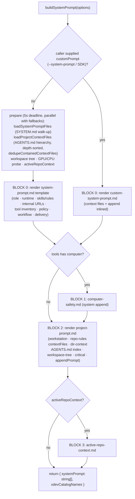

# omp internals — tool inventory, call mechanics, system-prompt assembly (primary-source)

**Date:** 2026-09-09 · **Method:** direct inspection of the installed package
`@oh-my-pi/pi-coding-agent@18.0.7` at `~/node_modules/@oh-my-pi/pi-coding-agent` (TypeScript `src/` ships in the npm tarball; every claim below carries a `file:line` anchor into that tree, siblings `@oh-my-pi/pi-agent-core`, `@oh-my-pi/pi-ai`, `@oh-my-pi/pi-wire`, `@oh-my-pi/pi-utils`, `@oh-my-pi/hashline`, `@oh-my-pi/pi-catalog`) plus `~/.omp/agent/` runtime state (`config.yml`, `AGENTS.md`, `PERSONALITY.md`, `managed-skills/`, `memories/`). The `omp` binary is a shim → `dist/cli.js`, a Bun-compiled Mach-O; the JS source is the ground truth.

**Position vs prior docs:** builds on `docs/research/2026-09-09-omp-pi-architecture-go-rebuild.md` (authoritative blueprint) and `docs/research/parity-tools-providers.md` (66-line parity sketch). This doc replaces the sketch's Section A–E tool claims with verbatim evidence and adds what neither doc had: exact input schemas, the arg-repair pipeline, the approval/guard ladder, and the prompt-assembly order. Deltas in §6.

---

## 1. Tool registry — complete inventory

### 1.1 Canonical lists (verbatim, `src/tools/builtin-names.ts`)

```ts
export const BUILTIN_TOOL_NAMES = [
	"read","bash","edit","ast_grep","ast_edit","ask","debug","eval","github","glob","grep","lsp",
	"inspect_image","browser","computer","checkpoint","rewind","security_scan","task","hub","todo",
	"web_search","write","memory_edit","retain","recall","reflect","learn","manage_skill",
] as const;                                              // 29 builtins

export const HIDDEN_TOOL_NAMES = ["yield", "goal", "think"] as const;

const LEGACY_BUILTIN_TOOL_NAME_ALIASES = new Map([["search","grep"],["find","glob"]]);
export function isMCPToolName(name: string): boolean { return name.startsWith("mcp__"); }
```

`normalizeToolName()` lowercases and maps aliases; MCP tools keep their `mcp__<server>_<tool>` wire name.

### 1.2 Factory maps (`src/tools/index.ts:455-490`)

`BUILTIN_TOOLS: Record<BuiltinToolName, ToolFactory>` — every factory is `(session) => new XTool(session)` except conditional constructors (`AskTool.createIf`, `DebugTool.createIf`, `GithubTool.createIf`, `LspTool.createIf`, `CheckpointTool.createIf`, `RewindTool.createIf`, `MemoryEditTool.createIf`, …). `HIDDEN_TOOLS = { think, yield, goal }` are appended only when active: `yield` when the session accepts yields, `think` when `externalThinkingActive` (model cannot honor native reasoning-off), `goal` only while goal mode is active.

Non-builtin tool sources: `generate_image` (a **CustomTool**, not a builtin name; registered when `generate_image.enabled` and not filtered — `sdk.ts:2026-2033`), extension-registered tools, SDK custom tools, RPC host tools, and MCP (`mcp__*`). The `write` tool doubles as the **xd:// device transport** (`read xd://` lists devices; `write xd://<tool>` executes them).

### 1.3 Core vs discoverable (`src/tools/essential-tools.ts:23-35`, verbatim)

```ts
export const ESSENTIAL_BUILTIN_TOOL_NAMES: Record<string, true> = {
	read: true, write: true, bash: true, edit: true, glob: true,
	computer: true, eval: true, task: true, hub: true, learn: true, manage_skill: true,
};
```

`loadMode` is `"essential" | "discoverable"` (`pi-agent-core/src/types.ts`): essential tools ride every request's callable schema; **discoverable tools are removed from the top-level schema** and surfaced either behind `xd://` device URLs (when `tools.xdev` is on) or via BM25 tool search. Adapter boundaries (extension `registerTool`, SDK, RPC) default an omitted `loadMode` to `"discoverable"`, but `defaultLoadModeForToolName()` pins the 11 essential names so re-registering a builtin never demotes it (issue #5764). Per-tool declared modes observed: essential = the 11 above; discoverable = `ast_grep, ast_edit, ask, debug, github, grep, lsp, inspect_image, browser, checkpoint, rewind, security_scan, todo, web_search, memory_edit, retain, recall, reflect`.

Conditional presence gates: `github` vanishes unless `git.github.available()` (the `gh` binary); `lsp` unless a server is configured; `checkpoint`/`rewind` need `checkpoint.enabled` and are subagent-off by default; memory quartet needs `memory.backend ∈ {hindsight, mnemopi}`; `learn`/`manage_skill` need `autolearn.enabled`; `security_scan` exists but its execute throws unless `security.enabled`; `debug` needs `debug.enabled` (registry gate at `tools/index.ts:650`).

---

## 2. Per-tool reference — verbatim schemas + mechanics

Schemas are `@oh-my-pi/omptype` `type(...)` (ArkType-flavoured), declared as file-local consts; `parameters` is sometimes a **getter** recomputed per session. All tools carry `name / label / approval / loadMode / strict`; the `i` intent field is injected on the wire (§3.2) and omitted from the schemas below. File paths relative to `pi-coding-agent/src/`.

### 2.1 read (`tools/read.ts:529`, class :615)
```ts
const readSchema = type({
	path: type("string").describe(
		"Local path, internal URI (e.g. memory://, skill://), or URL. Inline selectors are supported.",
	),
});
const readSchemaWithoutMemory = type({ /* same minus memory:// mention */ });
```
`get parameters()` returns the no-memory variant when `memory.backend === "off"`. **Approval:** `pathTargetsSsh()` → `"exec"`; selector-less PDF-image reads → `"exec"`; else `"read"`. Mechanics: selectors `:N, :N-M, :N+K, :N-` open-ended, comma multi-ranges, `:raw`, `:conflicts`, `:img` (SVG→PNG only), compound `raw:50-100`; invalid → `Invalid selector ':${sel}'. Use :N, :N-M, :N+K, :N- (open-ended), a comma-separated list of ranges, :raw, :img for SVG rendering, or a range combined with raw (e.g. :raw:50-100).` Parseable code with no selector → tree-sitter structural summary (caps `MAX_SUMMARY_BYTES = 2 MiB`, `MAX_SUMMARY_LINES = 20_000`, LRU `SUMMARY_CACHE_MAX = 48`; prose skipped unless `read.summarize.prose`). Repeat-read loop guard (`read.ts:594-620`): `REPEAT_READ_HINT_THRESHOLD = 3` identical xxHash64 outputs appends `[You have received this identical output N times. Re-reading '<path>' will not change it — use a narrower selector (path:A-B), or proceed with the edit.]`. Images: 20 MB cap (`MAX_IMAGE_SIZE`), oversize → `Image file too large: ${size} exceeds ${max} limit.`; when `inspect_image` is active, read returns metadata + pointer instead of an inline image. Hashline snapshot headers `[path#TAG]` are suppressed for files > `SNAPSHOT_MAX_BYTES` (4 MiB, `edit/file-snapshot-store.ts:15`) and header paths are workspace-relative. **URL half** (no separate fetch tool): `tools/fetch.ts:1639-1784` — backend chain `FETCH_PROVIDER_ORDER = ["native","trafilatura","lynx","parallel","jina"]`, `MAX_OUTPUT_CHARS = 500_000`, `MAX_BYTES = 50 MiB`, llms.txt probing (`.well-known/llms.txt`, `/llms.txt`, `/llms.md`, per-scope walk), markit conversion for pdf/docx/pptx/xlsx/epub, `.ipynb`, SQLite and archive listings, inline images 20 MB.

### 2.2 bash (`tools/bash.ts:316-324`)
```ts
const bashSchemaBase = type({
	command: type("string").describe("command to execute"),
	"env?": type({ "[string]": "string" }).describe("extra env vars"),
	"timeout?": type("number").describe(BASH_TIMEOUT_DESCRIPTION),
	"cwd?": type("string").describe("working directory"),
	"pty?": type("boolean").describe("run in pty mode"),
});
const bashSchemaWithAsync = type({ /* same + */ "async?": type("boolean").describe("run in background") });
```
Schema choice in constructor from `async.enabled`. **Approval** (`bash.ts:556-573`): `CRITICAL_BASH_PATTERNS` (`bash.ts:172-227`: `rm -rf /` variants, `--no-preserve-root`, `sudo rm`, `chmod/chown -R … /`, fork bomb, `> /dev/sd?`, `mkfs`, `dd …of=/dev/`, `shred`, `cryptsetup`, `> /etc/{passwd,shadow,sudoers}`, `tee /etc/…`, `curl|wget … | sh`, `bash <(curl…)`, `kill -9 1`, `shutdown|reboot`, `nc -e`) → `{tier:"exec", override:true, reason:"Critical pattern detected"}` — forces a prompt even in yolo. Settings `bash.patterns` (`match` glob → allow/deny/prompt): deny → `Blocked by bash pattern: ${rule.match}`; allow → `{tier:"write", policy:"allow"}` but **allow never rides compound lines** — any shell-control char (`\n\r;&|<>\`$()`) outside quotes (`hasBashApprovalShellControl`) or reinterpretation flags (`-c`, `--eval`) disqualifies; deny/prompt match per shell segment (`tokenizeShellSegments`). **Env hardening** (`exec/non-interactive-env.ts:8-76`, verbatim list): `PAGER/GIT_PAGER/MANPAGER/…=cat`, `LESS=FRX`, `TERM=dumb`, `NO_COLOR=1`, `PYTHONUNBUFFERED=1`, `GIT_EDITOR/VISUAL/EDITOR=true`, `GIT_TERMINAL_PROMPT=0`, `SSH_ASKPASS=$which("false")`, `CI=true`, `AGENT=1`, `npm_config_yes=true`, npm/pnpm/yarn/cargo/terraform/gh/composer/gcloud non-interactive defaults, `DEBIAN_FRONTEND=noninteractive`, `PIP_NO_INPUT=1`; `PI_BASH_NO_CI` (legacy `CLAUDE_BASH_NO_CI`) strips `CI`; Windows adds `PYTHONUTF8/LANG/LC_ALL=C.UTF-8`; direnv/devenv preflight folds repo env (caller `env` wins). Env-name validation `BASH_ENV_NAME_PATTERN = /^[A-Za-z_][A-Za-z0-9_]*$/` → `Invalid bash env name: ${key}`. Timeout clamp notice: `Timeout clamped to ${effective}s (requested ${requested}s; ${limit}).` (limit = global ceiling text or `allowed range ${min}-${max}s`); timeout is a non-throwing error result with `details.timedOut=true`. **OutputSink / spill** (`session/streaming-output.ts:9-21,40-91`): `DEFAULT_MAX_LINES = 3000`, `DEFAULT_MAX_BYTES = 50 KiB`, `DEFAULT_MAX_COLUMN = 512`; head window (`headBytes`, clamped ≤ threshold/2) + rolling tail share the inline budget; full stream persists via `session.allocateOutputArtifact("bash-original")` → `[raw output: artifact://N]` footer; artifact file itself `ARTIFACT_DEFAULT_MAX_BYTES = 0` (unbounded) with `ARTIFACT_DEFAULT_HEAD_BYTES = 3 MiB` head window when capped; final-defense `enforceInlineByteCap` reuses the artifact id. Footer notices `Wall time: X.XX seconds` / `Command exited with code N`. **Background:** `async:true` → `#startManagedBashJob` in `session.asyncJobManager` (label = command ≤120 chars, `bash` artifact, `TailBuffer(DEFAULT_MAX_BYTES)`); auto-background via `bash.autoBackground.{enabled,thresholdMs}`; missing manager → `Background job manager unavailable for this session.` PTY calls declare `concurrency:"exclusive"`.

### 2.3 edit (`edit/index.ts:403-423`; modes in `edit/modes/`, `edit/hashline/params.ts`, `edit/sloppy.ts`)
Five wire shapes; `EditMode = "replace" | "patch" | "hashline" | "apply_patch" | "sloppy"`; `DEFAULT_EDIT_MODE = "hashline"` (`utils/edit-mode.ts:4-6`).
```ts
// replace (edit/modes/replace.ts:1087)
export const replaceEditSchema = type({ path: "string", old_string: "string", new_string: "string", "replace_all?": "boolean" });
// patch (edit/modes/patch.ts:1702)
export const patchEditEntrySchema = type({ "op?": "'create' | 'delete' | 'update'", "rename?": "string", "diff?": "string" });
export const patchEditSchema = type({ path: "string", edits: patchEditEntrySchema.array() });
// hashline (edit/hashline/params.ts:7) — deliberately permissive; only `input` required
export const hashlineEditParamsSchema = type({ input: "string" });
// apply_patch (edit/modes/apply-patch.ts:14) — Codex *** Begin Patch envelope
export const applyPatchSchema = type({ input: "string" });
// sloppy (edit/sloppy.ts:96) — free-text envelope with [path] sections
export const sloppyEditSchema = type({ input: "string" });
```
**Mode selection** (`utils/edit-mode.ts:33-48`): `settings.getEditVariantForModel(model)` → env `PI_EDIT_VARIANT` → `edit.mode` → default `hashline`; then if mode is hashline and `!$flag("PI_STRICT_EDIT_MODE")` and the active model fails `supportsHashlineEdits()` (`pi-catalog/src/identity/family.ts:424` — Kimi, MiMo, DeepSeek V4 Flash, Step 3.7 Flash excluded for anchor miscounts) → downgrade to `sloppy`. **Hashline semantics** live in the `@oh-my-pi/hashline` package (`src/prompt.md`, 5.3 KB — the exact prompt embedded when hashline is the active mode): `[PATH#TAG]` sections with 4-hex snapshot tags from the read snapshot store, ops `PUT N.=M:` / `PUT N*:` / `PUT <N:` / `PUT >N:` / `PUT >N*:` / paste `@name` / `CUT` / `REM` / `MV`; hunks touching undisplayed lines are rejected; elision markers are invisible boundaries. **Approval:** all targets internal URLs (memory://, skill://, local://) → `"read"`, else `"write"`. **Replace mechanics:** empty old_string → `old_string must not be empty.`; 0 matches → `EditMatchError` closest-match diagnostic; >1 occurrences → occurrence error (unless `replace_all`); no-op → `Edits to ${path} resulted in no changes being made.`; BOM strip + LF normalize with line-ending restore; fuzzy matching via `PI_EDIT_FUZZY`/`PI_EDIT_FUZZY_THRESHOLD` (env or `edit.fuzzyMatch/fuzzyThreshold` settings) with `CONTEXT_FUZZY_THRESHOLD` and function-name fallback. **Multi-file cascade** stops on first failure (no partial apply): reports `Files already applied: ${paths}.` and `Files NOT applied: ${paths}; re-read the affected files and re-issue only the failed and unapplied files.` **Streaming preview** (`edit/streaming.ts`): per-mode `EDIT_MODE_STRATEGIES` with `extractCompleteEdits/computeDiffPreview/matcherDigest/matcherPaths/matcherEntries`; replace trusts `old_string` only after `partialJson` contains `"new_string"`; free-text modes trim the trailing partial line while streaming. **Auto-repair** (`edit/auto-repair.ts`) + suffix resolution (`findUniqueWorkspaceSuffix`) recover path drift before failing. LSP writethrough: format-on-write + diagnostics-on-edit with dedup ledger.

### 2.4 write (`tools/write.ts:306-309`)
```ts
const writeSchema = type({ path: type("string").describe("file path"), content: type("string").describe("file content") });
```
**Approval chain (order matters, `write.ts:484-527`):** (1) unwrap hashline `[path#TAG]` wrapper first so a wrapped `ssh://` target can't dodge scheme checks; (2) `xd://` device → tier of the mounted tool with `policyKey` = device name (so `tools.approval.<device>` is scoping); resolution devices `xd://resolve|reject|propose` stay `"read"`, `report_issue` `"write"`, unknown/malformed → `"exec"` (fail-closed); (3) `pathTargetsSsh` → `"exec"`; (4) else `resolveFileWriteApprovalTier`. Hashline display-mode strips `[PATH#HASH]` headers and `LINE:` prefixes models echo back. Content beginning `#!` → auto-chmod +x (`details.madeExecutable`). Archive writes (`zip/jar/tar/…`) validate `Archive write path must target a file inside the archive` / `not a directory` / `cannot contain '..'`, write temp + atomic rename, invalidate the fs-scan cache. SQLite rows `file.db:table:key`: rejects query strings (`SQLite write paths do not support query parameters`), empty table/key. `matcherDigest` returns the raw content so stream matchers see file content, not JSON escaping.

### 2.5 grep (`tools/grep.ts:82-95`)
```ts
const searchPathEntry = type("string").describe(
	'file, directory, glob, internal URL, or "<file>:<lines>" selector to search (e.g. "src/foo.ts:50-100", "src/foo.ts:50+10", "src/foo.ts:50-100,200-300")',
);
const searchSchema = type({
	pattern: type("string").describe("regex pattern"),
	"path?": searchPathEntry.describe('…; pass several as a semicolon-delimited list ("src; tests"). Omitted -> searches the workspace root (".")'),
	"case?": type("boolean").describe("case-sensitive search"),
	"gitignore?": type("boolean").describe("respect gitignore"),
	"skip?": type("number").or("null").describe("files to skip before collecting results — use to paginate when the prior call hit the file limit"),
});
```
Caps (`grep.ts:94-119`): `DEFAULT_FILE_LIMIT = 20` files; `MULTI_FILE_PER_FILE_MATCHES = 20`; `SINGLE_FILE_MATCHES = 200`; `INTERNAL_TOTAL_CAP = 2000`; `NATIVE_GREP_MAX_FILE_BYTES = 4 MiB` (mirrors Rust `MAX_FILE_BYTES` in `crates/pi-natives/src/grep.rs` — native grep searches a leading mmap window; partial-coverage note surfaced when explicitly targeted); `SEARCH_GREP_TIMEOUT_MS = 30_000`. Only line-range selectors accepted on path entries: `path entry "${entry}" — only line-range selectors like ":50-100" are supported (no ":raw"/":conflicts")`; glob+range → `Line-range selector requires a single file, not a glob: ${entry}`. Archive members materialized to a temp `omp-search-archive-<rand>` dir and remapped back to `archive:member` selectors. Match lines are recorded into the snapshot store (`recordFileSnapshot`/`recordSeenLinesFromBody`) so hashline edits can anchor on grep output.

### 2.6 glob (`tools/glob.ts:43-49`)
```ts
const findSchema = type({
	"path?": type("string").describe('glob, file, or directory to search — a single path or a semicolon-delimited list ("src/**/*.ts; test/**/*.ts"). Omitted -> searches the workspace root (".")'),
	"hidden?": type("boolean").describe("include hidden files"),
	"gitignore?": type("boolean").describe("respect gitignore"),
	"limit?": type("number").describe("max results"),
});
```
`DEFAULT_LIMIT = MAX_LIMIT = 200`; `DEFAULT_GLOB_TIMEOUT_MS = 5000`; `hidden ?? true`, `gitignore ?? true`; bad limit → `Limit must be a positive number`; root guard `Searching from root directory '/' is not allowed`; timeout returns partials: `glob timed out after ${s}s; returning ${n} partial matches — results are incomplete, scope to a deeper directory instead of retrying blindly`, and zero-match + timeout never claims absence (`… the scan is incomplete, NOT proof of absence. …`). Empty result flagged `useless` for compaction. Results mtime-ranked; `**/node_modules/**`, `**/.git/**` skipped.

### 2.7 ast_grep (`tools/ast-grep.ts:39-44`) / ast_edit (`tools/ast-edit.ts:46-57`)
```ts
const astGrepSchema = type({
	pat: type("string").describe("ast pattern"),
	"path?": type("string").describe('file, directory, glob, or internal URL to search; pass several as a semicolon-delimited list ("src; tests"). Omitted -> searches the workspace root (".")'),
	"skip?": type("number").describe("matches to skip"),
});
const astEditOpSchema = type({ pat: type("string").describe("ast pattern"), out: type("string").describe("replacement template") });
const astEditSchema = type({
	ops: astEditOpSchema.array().atLeastLength(1).describe("rewrite ops"),
	paths: type("string").describe("file, directory, glob, or internal URL to rewrite").array().atLeastLength(1)
		.describe("files, directories, globs, or internal URLs to rewrite"),
});
```
Both shell out to the native `pi-natives` ast-grep engine (Rust; per-language parsing). ast_grep: retention window `skip + limit + 1` (one extra detects `limitReached`), worst-eviction buffer then sort by `(path, startLine, startColumn, endLine, endColumn, byteStart, byteEnd)`, parse errors aggregated and capped. ast_edit: approval `"read"` iff every path is an internal URL else `"write"`; staged dry-run aggregation (`totalReplacements, filesTouched, filesSearched, limitReached, parseErrors`); edits recorded into the snapshot store for hashline tagging.

### 2.8 eval (`tools/eval.ts:104-116`)
```ts
const evalCellCommonFields = {
	"title?": type("string").describe('short label shown in transcript (e.g. "imports", "load config")'),
	"timeout?": type("number").describe("timeout for this eval call in seconds; 0 disables the cell timeout"),
	"reset?": type("boolean").describe("wipe this language's kernel before running. Other languages are untouched."),
};
export const evalSchema = type({
	language: type("'py' | 'js' | 'rb' | 'jl'").describe(describeLanguageField(EVAL_LANGUAGE_ORDER)),
	...evalCellCommonFields,
	code: type("string").describe(describeCodeField(EVAL_LANGUAGE_ORDER)),
});
```
Per-session wire schema narrowed via `buildEvalSchema(langs)` (`type.enumerated(...langs)`) — disabled backends are never advertised; cache keyed by joined language list, falls back to the full union when 0/all enabled so the default wire schema stays byte-identical. `concurrency:"exclusive"` — kernels persist (py IPython, js Bun VM, rb/jl REPLs). Backend gates: `Python backend is disabled (PI_PY=0 or eval.py = false).` / unavailable variant `… Pass language: "js" or "rb" or install the python kernel.` `MAX_DISPLAY_TEXT_BYTES = 8000` per `display()` value → `[…${n}ch elided…]`. `supportsCodeModeTransport()` true iff js enabled (inline code-mode transport + generated TS declarations — how the session's `eval` cell language works).

### 2.9 ask (`tools/ask.ts:66-92`)
```ts
const OptionItem = arkType({
	label: arkType("string").describe("display label"),
	"description?": arkType("string").describe("optional explanatory text displayed below the label"),
	"preview?": arkType("string").describe("optional rich preview content for interactive ask dialogs"),
});
const QuestionItem = arkType({
	id: arkType("string").describe("question id"),
	question: arkType("string").describe("question text"),
	"header?": arkType("string").describe("optional short display chip for rich ask dialogs"),
	options: OptionItem.array().describe("available options"),
	"multi?": arkType("boolean").describe("allow multiple selections"),
	"recommended?": arkType("number").describe("recommended option index"),
}).narrow((question, ctx) => { /* rejects reserved-label collisions */
	ctx.mustBe(`defined with option labels that do not collide with reserved runtime labels: ${reserved.label}`) });
const askSchema = arkType({ questions: QuestionItem.array().atLeastLength(1).describe("questions to ask") });
```
Reserved labels: `Other (type your own)`, `Chat about this`, `Next →` — `.narrow` fails at schema level (fail-closed). `RECOMMENDED_SUFFIX = " (Recommended)"` auto-appended/stripped; timeout auto-selects `recommended` else option 0 with `details.timedOut=true` (`TIMEOUT_DETECTION_TOLERANCE_MS = 1_000` attributes near-deadline closes to timeout, Esc = user cancel). `concurrency:"exclusive"` (blocks the turn); `chatRedirect` details abort answering into prose.

### 2.10 task (`task/types.ts:109-176`, `task/index.ts:507`)
Schemas are **dynamic** — `getTaskSchema({isolationEnabled, batchEnabled, effortEnabled, defaultAgent})` picks one of four static variants or builds+caches via `createTaskSchema`:
```ts
const outputSchemaInputSchema = type("object | boolean | string | null"); // ArkType serializes unknown as boolean subschema — llama.cpp grammars reject that
const effortRule = '"lo" | "med" | "hi"' as const;
export const taskItemSchema = type({ "name?": "string", agent: "string = 'task'", task: "string",
	"outputSchema?": outputSchemaInputSchema, "schemaMode?": '"permissive" | "strict"', "+": "delete" });
export const taskSchema = type({ /* flat + "isolated?" */ });
const taskSchemaBatch = type({ context: "string", tasks: taskItemSchemaIsolated.array(), "+": "delete" });
```
`agent: "string = 'task'"` default is re-derived when the spawn policy default differs (`taskAgentSchemaRule`: only `/^[A-Za-z0-9_-]+$/` names may inline as default). `strict=false` (`lenientArgValidation=true`) **because** the flat schema's `"+":"delete"` strips batch keys and fails with the misleading `task must be a string (was missing)` — raw args are forwarded so `validateShapeParams` emits the real errors: `Missing \`tasks\`. Provide at least one task item ({ name?, agent?, task }).`, `Top-level \`task\` is not part of the batch shape. Put the work in \`tasks[]\` items.`, `Task N ... is missing \`task\`. Every task needs complete, self-contained instructions.`, duplicates → `Duplicate task name ...`. Subagent slates come from agent-definition frontmatter (`tools, spawns, model, thinkingLevel, output, blocking, autoloadSkills, readSummarize, prewalk, advisor`); read-only policy allowlist (`task/read-only-policy.ts`): `read, grep, glob, web_search, ast_grep, yield, hub, ask, todo, recall, reflect, retain, memory_edit, inspect_image, checkpoint, rewind`. **Scheduling:** spawn policy (`task/spawn-policy.ts`) — `"*"` unrestricted (default agent `task`), `false`/empty disables, CSV → first entry is defaultAgent; per-session `Semaphore` resized live from `task.maxConcurrency` (settings default **32**, `config/settings-schema.ts:4946`); `task.maxRecursionDepth` default 2 (`<0` uncapped) gates whether the child holds `task`; advisory nudges (≥2 generic workers → "read-only research belongs on `agent: \"scout\"`, which runs on a faster model."). **Async job contract** (`async/job-manager.ts`): `DEFAULT_RETENTION_MS = 5 min` (settled job ids evicted; afterwards addressable via `hub send`/`agent://`), `DEFAULT_MAX_RUNNING_JOBS = 15` → `Background job limit reached (15). Wait for running jobs to finish or cancel one.`, smart poll ladder `[5s,10s,30s,60s,300s]` with 60s escalation reset. Settled results route owner-scoped as `async-result` custom messages (`session/async-job-delivery.ts`): `ASYNC_INLINE_RESULT_MAX_CHARS = 12_000`, preview 4000 chars, longer spills to artifact. Output caps: `MAX_OUTPUT_BYTES = 500_000` (`PI_TASK_MAX_OUTPUT_BYTES`), `MAX_OUTPUT_LINES = 5000`, parent preview `fullOutputThreshold = 5000` chars cut at last newline + `outputPath`. **Soft request budgets** (`task/executor.ts:70-96`): `SOFT_REQUEST_BUDGET = { scout: 100, sonic: 100, default: 200 }`, grace `BUDGET_STOP_GRACE_REQUESTS = 5`; crossing injects `[budget notice] You have used N requests in this run (soft budget: B). Wrap up now: … At 1.5B requests the run is force-stopped …`. Arg repair (`task/repair-args.ts`) un-double-escapes JSON-double-encoded prose in `task`/`context` only. Isolation (`task/worktree.ts`): backends `worktree|rcopy` → Rcopy, `fuse-overlay|fuse-projfs` → Fuse; `ISOLATION_BASELINE_MAX_CONTENT_BYTES = 1 GiB`; `.git` metadata detached from the source checkout.

### 2.11 hub (`tools/hub/index.ts:80-147`)
```ts
const hubSchema = type({
	op: type("'send' | 'wait' | 'inbox' | 'list' | 'jobs' | 'cancel' | 'start' | 'ps' | 'logs' | 'stop' | 'restart' | 'describe'").describe("hub operation"),
	"to?": type("string").describe('send: recipient agent id or "all"'),
	"message?": type("string").describe("send: message body"),
	"replyTo?": type("string").describe("send: message id being answered"),
	"await?": type("boolean").describe("send: wait for the recipient's reply (invalid with to:\"all\")"),
	"from?": type("string").describe("wait: only accept a message from this agent id"),
	"ids?": type("string[]").describe("wait: job ids to watch (omit = all running jobs); cancel: job ids to kill"),
	"timeoutMs?": type("number").describe("wait (messages/jobs): timeout in milliseconds (0 waits indefinitely)"),
	"peek?": type("boolean").describe("inbox: list messages without consuming them"),
	"status?": type("'running' | 'idle' | 'parked'").describe("list: filter by status; omit for running+idle"),
	"limit?": type("number > 0").describe(`list: max peer rows; default ${DEFAULT_HUB_LIST_LIMIT}, max ${MAX_HUB_LIST_LIMIT}`),
	"name?": type("string <= 48").describe("process ops: stable project-scoped launch name"),
	"application?": type("string > 0").describe("start: executable or application path"),
	"args?": type("string[]").describe("start: argv passed directly to the application"),
	"env?": type({ "[string]": "string" }).describe("start: extra environment variables"),
	"cwd?": type("string").describe("start: working directory; defaults to the session directory"),
	"pty?": type("boolean").describe("start: allocate an interactive PTY; default true"),
	"ready?": type({
		"log?": type("string > 0").describe("regex matched against output"),
		"port?": type("number").describe("TCP port that must accept connections"),
		"host?": type("string > 0").describe("TCP readiness host; default 127.0.0.1"),
		"timeout?": type("number > 0").describe("seconds to wait; default 30"),
	}).describe("start: readiness conditions; all supplied conditions must pass"),
	"restart?": type("'no' | 'on-failure' | 'always'").describe("start: restart policy; default no"),
	"persist?": type("boolean").describe("start: survive the last omp client exiting; default false"),
	"detached?": type("boolean").describe("start: survive every omp and broker exit; implies persist and disables PTY input"),
	"lines?": type("number > 0").describe("logs: output lines; default 100, max 1000"),
	"head?": type("boolean").describe("logs: read from the beginning instead of the tail"),
	"grep?": type("string > 0").describe("logs: regex filter"),
	"follow?": type("boolean").describe("logs: wait for output newer than cursor"),
	"cursor?": type("number >= 0").describe("logs: output cursor returned by an earlier call"),
	"for?": type("'ready' | 'exit'").describe("wait with name: lifecycle condition; default exit"),
	"pattern?": type("string > 0").describe("wait with name: output regex; takes precedence over for"),
	"text?": type("string > 0").describe("send with name: stdin text"),
	"enter?": type("boolean").describe("send with name: append Enter after text; default true"),
	"keys?": type("string[]").describe("send with name: terminal keys after text"),
	"signal?": type("'SIGINT' | 'SIGTERM' | 'SIGHUP' | 'SIGQUIT' | 'SIGKILL'").describe("send with name: process-tree signal"),
	"timeout?": type("number > 0").describe("logs/stop/wait with name: max seconds; default 30 (stop: 5)"),
});
```
Roster: `DEFAULT_HUB_LIST_LIMIT = 32`, `MAX_HUB_LIST_LIMIT = 100`; `op:"list"` returns live rows + tallies `{running, idle, parked, shown, truncated}` (parked names only with `status:"parked"`). `wait` returns on the FIRST of peer message / watched job settling / window elapsing / steering interrupt; poll windows fixed (`5s|10s|30s|1m|5m`, default 30s) or `"smart"` ladder `[5_000, 10_000, 30_000, 60_000, 300_000]` ms, `POLL_ESCALATION_RESET_MS = 60_000`. **Owner scoping:** `visibleJobs` (`hub/jobs.ts`) silently drops other agents' job ids; wait where nothing settled is marked `useless`. Registry sub-agents without job rows are appended with a `live` flag (stale registrations detectable; `hub cancel` clears). Process ops route through the daemon broker; `ready` = ALL conditions (log regex AND TCP port); `stop` = graceful process-tree termination before hard kill. `interruptible` for `op:"wait"` and `logs` with `follow:true` (abort surfaces the current snapshot; see §3.6). 12 `ToolExample`s ship verbatim in source.

### 2.12 todo (`tools/todo.ts:69-92`, `session/todo-tracker.ts`)
```ts
const TodoOp = type('"init" | "start" | "done" | "rm" | "drop" | "block" | "unblock" | "append" | "view"').describe("operation to apply");
const InitListEntry = type({
	phase: type("string").describe("phase name"),
	items: type("string").describe("task content").array().atLeastLength(1).describe("tasks for this phase"),
});
const todoSchema = type({
	op: TodoOp,
	"list?": InitListEntry.array().describe("phased task list (init)"),
	"task?": type("string").describe("task content"),
	"phase?": type("string").describe("phase name"),
	// No `atLeastLength(1)` here: `items` is only meaningful for `init`/`append` …
	"items?": type("string").describe("task content").array().describe("tasks for single-phase init or append"),
	"reason?": type("string").describe("blocker note (block op)"),
}).describe("apply a single todo operation");
```
Statuses: `pending | in_progress | completed | abandoned | blocked` (+ `blocker` note); markdown round-trip markers `[ ] [x] [/] [-] [!]`. **Persistence is the session file**, not a db: `TodoTracker#phases` on the AgentSession, rehydrated via `getLatestTodoPhasesFromEntries`, `details.storage` reports `"session"|"memory"`. **Whole-batch discard on any error** — persisting a half-applied batch would make the retry hit `"already exists"` (`todo.ts:884-890`). **Tasks are referenced by exact content, not ids:** `Task "task-1" not found. Tasks are referenced by content, not by IDs — pass the task's full text from the previous result.` Flat `{op:"init", items:[…]}` is repaired into a one-phase list named `"Tasks"` (`DEFAULT_INIT_PHASE`). **Mid-run nudge** (`todo-tracker.ts:287-308`): `MID_RUN_NUDGE_MUTATION_THRESHOLD = 12` successful mutating results (`bash, eval, edit, write, ast_edit`) since the last `todo` call, `MID_RUN_NUDGE_MAX_PER_CYCLE = 2`; gated on `todo.enabled` + `todo.reminders`, off in plan mode. Renderer caps: `PREVIEW_LIMITS.COLLAPSED_ITEMS = 8`, `COLLAPSED_CLOSED_CONTEXT = 1`. `lenientArgValidation=true`, `concurrency:"exclusive"`.

### 2.13 web_search (`web/search/index.ts:42-49`)
```ts
export const webSearchSchema = type({
	query: "string",
	recency: "'day' | 'week' | 'month' | 'year'?",
	limit: "number?",
	max_tokens: "number?",
	temperature: "number?",
	num_search_results: "number?",
});
```
Providers (`web/search/types.ts:12-140`) — one list feeds both the settings dropdown and the fallback order: `auto` + 22 ids: `perplexity, gemini, anthropic, codex, xai, zai, exa, tinyfish, jina, kagi, tavily, firecrawl, brave, kimi, parallel, synthetic, searxng, startpage, duckduckgo, ecosia, google, mojeek, public` (`public` = fan-out over every credential-free engine). Explicit provider ≠ auto → single candidate, unavailability is a hard error `"<Label> web search is unavailable. Configure its credentials or select the automatic provider chain."`; auto walks the chain skipping unavailable; empty-handed → `No web search provider configured.` Timeouts `DEFAULT_WEB_SEARCH_TIMEOUT_SECONDS = 60`, ceiling 300 (`providers.webSearchTimeoutSeconds`). Parsed `site:/inurl:/intitle:/filetype:/date` directives the provider couldn't honor are re-applied leniently over returned sources, relaxing any dimension that would wipe all results, each surfacing as `Note: no results matched \`label\`; the constraint was relaxed`. Snippets/citedText truncated at 240 chars; queries capped 3 × 120 chars.

### 2.14 github (`tools/gh.ts:62-97`)
```ts
const GITHUB_READONLY_OPS: ReadonlySet<string> = new Set([
	"repo_view","file_read","search_issues","search_prs","search_code","search_commits","search_repos","run_watch"]);
const githubSchema = type({
	op: type("'repo_view' | 'file_read' | 'pr_create' | 'pr_checkout' | 'pr_push' | 'search_issues' | 'search_prs' | 'search_code' | 'search_commits' | 'search_repos' | 'run_watch'").describe("github operation"),
	"repo?": type("string").describe("owner/repo"), "branch?": type("string").describe("branch"),
	"path?": type("string").describe("repository-relative file path"),
	"pr?": type("string | string[]").describe("pr number, url, or branch"),
	"force?": type("boolean").describe("reset existing local branch"),
	"forceWithLease?": type("boolean").describe("force-with-lease push"),
	"title?": type("string").describe("pr title"), "body?": type("string").describe("pr body markdown"),
	"base?": type("string").describe("pr base branch"), "head?": type("string").describe("pr head branch"),
	"draft?": type("boolean").describe("open pr as draft"), "fill?": type("boolean").describe("auto-fill pr title/body from commits"),
	"reviewer?": type("string[]").describe("reviewers"), "assignee?": type("string[]").describe("assignees"),
	"label?": type("string[]").describe("labels"), "query?": type("string").describe("search query"),
	"since?": type("string").describe("lower-bound date filter"), "until?": type("string").describe("upper-bound date filter"),
	"dateField?": type("'created' | 'updated'").describe("date field"), "limit?": type("number").describe("max results"),
	"run?": type("string").describe("actions run id or url"), "tail?": type("number").describe("log lines per failed job"),
});
```
Approval: read-only ops → `"read"`; `pr_create/pr_checkout/pr_push` → `"exec"`. One flat schema for 11 ops — per-op requirements enforced in `execute` with named errors, not per-op schemas. `pr_checkout` always goes to dedicated worktrees (`gh-pr-checkout.ts`, `WORKTREE_PATH_MAX_SUFFIX = 100`, fork remote naming); `run_watch` polls 3s/15s, gives up at 90s, tails 15/200 log lines per failed job (`gh-run-watch.ts`). Tool vanishes entirely when `gh` is absent.

### 2.15 lsp (`lsp/types.ts:8-22`)
```ts
export const lspSchema = type({
	action: "'diagnostics' | 'definition' | 'references' | 'hover' | 'symbols' | 'rename' | 'rename_file' | 'code_actions' | 'type_definition' | 'implementation' | 'status' | 'reload' | 'capabilities' | 'request'",
	file: "string?", line: "number?", symbol: "string?", query: "string?", new_name: "string?",
	apply: "boolean?",
	"timeout?": type.number.atLeast(TOOL_TIMEOUTS.lsp.min).atMost(TOOL_TIMEOUTS.lsp.max)
		.describe("Timeout in seconds (default 20; range 5–300)."),
	payload: "string?",
});
```
`LSP_READONLY_ACTIONS = {diagnostics, definition, type_definition, implementation, references, hover, symbols, status, capabilities}` → `"read"`; rest → `"write"`; read-only sessions hard-fail write actions. Diagnostics waits: single 3000 ms, batch 400 ms (poll 100/settle 250), pipeline grace 10 s; glob diagnostics ≤ `MAX_GLOB_DIAGNOSTIC_TARGETS = 20` files; workspace symbols `WORKSPACE_SYMBOL_LIMIT = 200`; `MAX_RENAME_PAIRS = 1000`. **Late diagnostics** (`session/messages.ts:44`): edit/write run `DeferredDiagnostics`; entries of type `lsp-late-diagnostic` are flushed at idle as a `<system-notice>` — `Late LSP diagnostics arrived after the edit returned:`. Server selection via `lsp/defaults.json` (fileTypes/rootMarkers/initOptions; rust-analyzer special-cased).

### 2.16 debug (`tools/debug.ts:79-155`)
```ts
const debugActionSchema = type.enumerated(
	"launch","attach","set_breakpoint","remove_breakpoint","set_instruction_breakpoint","remove_instruction_breakpoint",
	"data_breakpoint_info","set_data_breakpoint","remove_data_breakpoint","continue","step_over","step_in","step_out",
	"pause","evaluate","stack_trace","threads","scopes","variables","disassemble","read_memory","write_memory",
	"modules","loaded_sources","custom_request","output","terminate","sessions");
const debugSchema = type({
	action: debugActionSchema,
	"program?": type("string").describe("debug target path; Delve accepts Go package directories"),
	"args?": type("string[]").describe("program arguments"),
	"adapter?": type("string").describe("configured adapter id (gdb, lldb-dap, debugpy, dlv, rdbg, or dap.json entry)"),
	cwd: "string?", "file?": type("string").describe("source file"), "line?": type("number").describe("source line"),
	"function?": type("string").describe("function name"), "name?": type("string").describe("variable or data name"),
	"condition?": type("string").describe("breakpoint condition"), hit_condition: "string?",
	"expression?": type("string").describe("expression to evaluate"),
	"context?": type("string").describe("evaluate context: watch | repl | hover | variables | clipboard"),
	frame_id: "number?", "scope_id?": type("number").describe("scope variables reference"),
	"variable_ref?": type("number").describe("variable reference"), "pid?": type("number").describe("process id for attach"),
	"port?": type("number").describe("remote attach port"), "host?": type("string").describe("remote attach host"),
	"levels?": type("number").describe("max stack frames"), "memory_reference?": type("string").describe("memory reference or address"),
	instruction_reference: "string?", instruction_count: "number?", instruction_offset: "number?",
	"count?": type("number").describe("bytes to read"), "data?": type("string").describe("base64 memory payload"),
	"data_id?": type("string").describe("data breakpoint id"), "access_type?": "'read' | 'write' | 'readWrite'",
	"command?": type("string").describe("custom dap request command"),
	"arguments?": type({ "[string]": "unknown" }).describe("custom request arguments"),
	offset: "number?", resolve_symbols: "boolean?", allow_partial: "boolean?", start_module: "number?", module_count: "number?",
	"timeout?": type("number").describe("per-request timeout seconds"),
});
```
`DEBUG_READONLY_ACTIONS = {output, threads, stack_trace, scopes, variables, disassemble, read_memory, loaded_sources, modules, sessions}` → `"read"`; all execution-side actions → `"exec"`. Built-in adapters (`dap/defaults.json`, overridable by `dap.json`): `gdb` (`gdb -i dap`), `lldb-dap`, `codelldb` (`--port 0`), `debugpy` (`python -m debugpy.adapter`), `dlv` (`dlv dap`, socket connect, accepts directory programs), `js-debug-adapter` (pwa-node), `netcoredbg`, `kotlin-debug-adapter`, `elixir-ls-debugger`. Attach: explicit `port` prefers debugpy else walks `["gdb","lldb-dap"]`; dlv launch forces `mode: "debug"` for directories/`.go`, else `exec`. Transport hardening (`dap/client.ts`): adapters spawned setsid (no controlling terminal — debuggee children can't SIGTTIN-suspend the harness), `SOCKET_READY_TIMEOUT_MS = 10_000`, `WRITE_MESSAGE_TIMEOUT_MS = 30_000` self-disposes a wedged adapter stdin. `concurrency:"exclusive"`.

### 2.17 checkpoint + rewind (`tools/checkpoint.ts:29-37`)
```ts
const checkpointSchema = type({ goal: type("string").describe("investigation goal") });
const rewindSchema = type({ report: type("string").describe("investigation findings") });
```
**NOT a git shadow repo** despite the legacy summary string — it is a **session-tree checkpoint**. `CheckpointState = {checkpointMessageCount, checkpointEntryId, startedAt}`; on the checkpoint toolResult's `message_end` the entry id is backfilled. Rewind (`agent-session.ts:7477-7519` `#applyRewind`): `sessionManager.branchWithSummary(checkpointEntryId, report, {startedAt})` — a leaf-pointer branch cut back to the checkpoint entry with a persisted `rewind-report` custom message retaining the findings; missing entry falls back to root (`Rewind branch checkpoint missing, falling back to root`). Guard errors: `Checkpoint already active.` / `No active checkpoint. Create a checkpoint before calling rewind.` / `Checkpoint already completed; continue from the retained rewind report instead of calling rewind again.` / `Report cannot be empty.` **Enforcement:** `#enforceRewindBeforeYield` (`agent-session.ts:7437`) injects a `<system-warning>` — `You are in an active checkpoint. You MUST call rewind with your investigation findings before yielding. Do NOT yield without completing the checkpoint.` — and schedules a continue. State is rehydrated from the branch on resume; compaction/reset clears it. Both `approval:"read"`, `loadMode:"discoverable"`, subagent-off unless the agent-definition `tools:` frontmatter lists them (sister tool auto-included). Prompt rules (`prompts/tools/checkpoint.md`): `MUST \`rewind\` before yielding after starting a checkpoint.` · `NEVER \`checkpoint\` while another checkpoint active.`

### 2.18 inspect_image (`tools/inspect-image.ts:37-42`)
```ts
const inspectImageSchema = type({
	path: type("string").describe("image file path, local .svg/.svgz path with :img, Image #N label, or attachment://N URI"),
	question: type("string").describe("question about image"),
	"+": "reject",
});
```
`IMAGE_ATTACHMENT_REFERENCE_REGEX = /^\s*(?:\[?Image #([1-9]\d*)(?:,[^\]\n]*)?\]?|(?:attachment|image):\/\/([1-9]\d*))\s*$/i` resolves turn-local 1-based attachments; unresolvable → `Could not resolve image attachment '<p>'. Available image attachm…` Vision-model order: `@vision` role → `@default` → active session model → first available; no image-input support → `Resolved model <p>/<id> does not support image input. Configure a vision-…` `strict=false`. SVG rasterized to max edge `SVG_IMAGE_MAX_EDGE_PX = 2048`; timeout from `inspect_image.timeoutMs` (0 disables).

### 2.19 browser (`tools/browser.ts:48-75`)
```ts
const appSchema = type({
	"path?": type("string").describe("binary path to spawn"),
	"cdp_url?": type("string").describe("existing cdp endpoint"),
	"relay?": type("boolean").describe("drive the user's own tabs via the omp browser relay"),
	"args?": type("string[]").describe("extra cli args"),
	"target?": type("string").describe("substring to pick a window"),
});
const browserSchema = type({
	action: type("'open' | 'close' | 'run'").describe("operation"),
	"name?": type("string").describe("tab id (default 'main')"),
	"url?": type("string").describe("url to open"),
	"app?": appSchema,
	"viewport?": { width: "number", height: "number", "scale?": "number" },
	"wait_until?": type("'load' | 'domcontentloaded' | 'networkidle0' | 'networkidle2'").describe("navigation wait condition"),
	"dialogs?": type("'accept' | 'dismiss'").describe("auto-handle dialogs"),
	"code?": type("string").describe("js body to run in tab"),
	"timeout?": type("number").describe("timeout in seconds"),
	"all?": type("boolean").describe("release every managed tab"),
	"kill?": type("boolean").describe("also kill spawned-app browsers"),
});
```
Three actions only; `run` executes JS with `page`/`browser`/`tab` helpers in scope (Playwright-core). Browser-kind precedence: `app.cdp_url` → `app.path` (spawned) → explicit `app.relay` → `app.relay !== false` + `browser.relay` setting → `browser.cdpUrl` → headless. `PI_BROWSER_RELAY` is the final kill switch. `approval:"exec"`, timeout clamp 30/300 s; failure releases the acquired tab handle. `restartForModeChange()` = `dropHeadlessTabs()`.

### 2.20 computer (`tools/computer.ts:53`)
```ts
const getComputerSchema: () => ComputerSchema = once(() =>
	type({
		code: type("string").describe(
			"JavaScript executed in the persistent computer session; top-level await allowed; `desktop`, `wait`, `assert` in scope"),
		"read_only?": type("boolean").describe(
			"true = inspection only: screenshots and ax reads allowed, all input/mutation blocked"),
		"timeout?": type("number").describe("run budget in seconds"),
		"+": "reject",
	}));
```
Approval fn: `args.read_only === true ? "read" : "exec"`. Runs JS in a persistent worker with macOS Accessibility APIs (`DesktopCapabilities` from TCC); `concurrency:"exclusive"`; timeout clamp 120/300 s. Coordinate-safe capture clamp `COORDINATE_SAFE_MAX_CAPTURE_WIDTH = 1280`, `…HEIGHT = 896` applied when the model can't preserve native screenshot detail (compat `supportsImageDetailOriginal === false` or Claude family) so pointer actions match what the model sees. `read_only` enforced **inside the worker**, matching the tier. Safety text is a system append (`prompts/system/computer-safety.md`), not a tool description; the system template adds a dedicated `# Computer Use` section when the tool is active.

### 2.21 security_scan (`tools/security-scan.ts:19`)
```ts
const securityScanSchema = type({
	action: "'preflight' | 'start' | 'status' | 'cancel' | 'validate' | 'cloud_scans' | 'cloud_start' | 'cloud_status' | 'cloud_pull'",
	"plan_id?": "string", "operation_id?": "string",
	"target_kind?": "'repository' | 'scoped_path' | 'ref_diff' | 'working_tree'",
	"include_paths?": "string[]", "exclude_paths?": "string[]",
	"base_revision?": "string", "head_revision?": "string", "knowledge_base_paths?": "string[]",
	"output_root?": "string", "archive_existing?": "boolean", "credential_id?": "number.integer >= 1",
	"scan_id?": "string", "finding_id?": "string",
	"validation_status?": "'unvalidated' | 'validated' | 'rejected' | 'partial' | 'error'",
	"validation_summary?": "string",
	"validation_evidence?": type({ label: "string > 0", explanation: "string" }).array(),
	"cloud_configuration_id?": "string", "repository_id?": "string", "repository_url?": "string",
	"environment_id?": "string", "lookback_days?": "number.integer >= 1 | 'all'",
});
```
`approval:"exec"`. Fail-closed gate first thing in execute: `if (!settings.get("security.enabled")) throw new ToolError("Security is disabled. Enable security.enabled before using security_scan.")`. Multi-action state machine over the `security/` subsystem (preflight → start → status → validate with evidence ids; cloud ops via Codex Security cloud client requiring the auth registry). `security://` read URI in the system prompt is gated by `securityEnabled`.

### 2.22 Memory quartet (`tools/memory-{edit,retain,recall,reflect}.ts`) — mnemopi/hindsight only
```ts
// memory_edit.ts:12 (memory.backend === "mnemopi" only)
const memoryEditSchema = type({
	_op: type("'update' | 'forget' | 'invalidate'").describe("memory edit operation"),
	id: type("string").describe("memory id from recall output"),
	"content?": type("string").describe("replacement content for update"),
	"importance?": type("number").describe("replacement importance for update (0–1)"),
	"replacement_id?": type("string").describe("replacement memory id for invalidate"),
});
// memory-retain.ts:11 (hindsight | mnemopi)
const memoryRetainSchema = type({
	items: type({ content: type("string").describe("information to remember"),
		"context?": type("string").describe("source context") }).array().atLeastLength(1).describe("memories to retain"),
});
// memory-recall.ts:11
const memoryRecallSchema = type({ query: type("string").describe("natural language search query") });
// memory-reflect.ts:12
const memoryReflectSchema = type({ query: type("string").describe("question to answer"),
	"context?": type("string").describe("optional context") });
```
All `approval:"read"`, `loadMode:"discoverable"`. retain → mnemopi `rememberScoped` per item with `importance: 0.75, source: "coding-agent-retain", scope: "bank", extract: true, extractEntities: true, veracity: "tool", memoryType: "fact"`; hindsight enqueues into a debounced batch queue (failures are UI-only warnings, never LLM-visible). recall/reflect empty → `"No relevant memories found."` + `useless: true`. Backend union (`memory-backend/types.ts`): `MemoryBackendId = "off" | "local" | "hindsight" | "mnemopi"`; each backend owns session state, a `buildDeveloperInstructions()` system-prompt append, and optional `preCompactionContext()` splicing memory into compaction summaries (local opts out).

### 2.23 learn (`tools/learn.ts:9-22`) / manage_skill (`tools/manage-skill.ts:14-26`)
```ts
const learnSchema = type({
	memory: type("string").describe("the durable, self-contained lesson to remember (what, when, why)"),
	"context?": type("string").describe("optional source context for the lesson"),
	"skill?": type({
		action: "'create' | 'update'",
		name: type("string").describe("kebab-case skill name"),
		description: type("string").describe("one-line description of when to use the skill"),
		body: type("string").describe("the SKILL.md body in markdown (no frontmatter)"),
	}).describe("also create or enhance a managed skill in the same call"),
});
const manageSkillSchema = type({
	action: "'create' | 'update' | 'delete'",
	name: type("string").describe("kebab-case skill name"),
	"description?": type("string").describe("one-line description of when to use the skill (required for create/update)"),
	"body?": type("string").describe("the SKILL.md body in markdown, no frontmatter (required for create/update)"),
}).narrow((p, ctx) => p.action === "delete" || (p.description !== undefined && p.body !== undefined)
	|| ctx.mustBe('used with both "description" and "body" for "create" and "update"'));
```
learn approval is dynamic: `"write"` when `skill` present or backend `"local"`, else `"read"`. manage_skill: the `.narrow` cross-field contract (kept as narrow, not a discriminated union, so the wire schema stays a single root object — strict structured-output mode and the Anthropic tool-schema builder both require that). Managed-skill primitives (`autolearn/managed-skills.ts`): dir `~/.omp/agent/managed-skills` isolated from authored `~/.omp/agent/skills` (`MANAGED_SKILLS_PROVIDER_ID = "omp-managed"`); `MAX_MANAGED_SKILL_BYTES = 64_000` (final file bytes); `SKILL_NAME_PATTERN = /^[a-z0-9][a-z0-9-]{0,63}$/` → `Invalid skill name "${raw}". Use lowercase letters, digits, and hyphens (1-64 chars, starting with a letter or digit).`; description sanitizer on write AND read (trust boundary): `raw.replace(/[\p{Cc}\p{Cf}]/gu," ").replace(/[<>\`]/g,"").replace(/~{2,}/g,"~").replace(/\s+/g," ").trim()` — kills `<system-directive>`/`</skills>` prompt breakout; symlink/hardlink hardening (`The managed-skills root is a symlink; refusing to operate outside the managed directory.`); create uses `wx` flag; per-name in-process mutation serialization. Authored-shadow guard: managed skills cannot shadow authored ones (`an authored skill of that name already exists, and managed skills cannot override authored ones. Choose a different name.`).

### 2.24 Hidden tools — yield / goal / think
**yield** (`tools/yield.ts:290`, label `Submit Result`): no static `type()` schema — a JSON-Schema wrapper built per constructor:
```ts
function wrapYieldParameters(dataSchema: Record<string, unknown>): Record<string, unknown> {
	const successResultSchema = { type: "object", additionalProperties: false, description: "task succeeded",
		properties: { data: dataSchema }, required: ["data"] };
	const errorResultSchema = { type: "object", additionalProperties: false,
		properties: { error: { type: "string", description: "error message" } }, required: ["error"] };
	const lastTurnResultSchema = { type: "object", additionalProperties: false,
		description: "typed task succeeded; data omitted so the last assistant turn is used", properties: {}, required: [] };
	return { type: "object", additionalProperties: false, description: "submit data or error",
		properties: { type: yieldTypeSchema, result: { anyOf: [successResultSchema, errorResultSchema, lastTurnResultSchema] } },
		required: ["result"] };
}
// yieldTypeSchema = { anyOf: [{type:"string"}, {type:"array", minItems:1, items:{type:"string"}}],
//   description: "Optional result type. A non-empty string array is incremental; a string is terminal." }
```
`strict` flips to `false` whenever the caller's `outputSchema` can't be strict-represented. Retry budgets `MAX_SCHEMA_RETRIES = 3`, `MAX_EMPTY_RESULT_RETRIES = 3`; after exhaustion the payload is accepted anyway with `details.schemaOverridden=true` (executor honors the override instead of re-rejecting). Exact rejection texts: both data+error → `result cannot contain both data and error`; missing wrapper → `result must be an object containing either data or error. ${YIELD_RESULT_FORMAT_HINT}` with hint `Submit success as {"result":{"data":<your output>}} or failure as {"result":{"error":"message"}}.`; schema violation → `${scope} does not match schema: ${formatAllValidationIssues(issues)}. Call yield again with the corrected shape — ${remaining} retry attempt(s) remain before the schema constraint is dropped.`; unknown incremental labels → `Section ${labels} uses unknown incremental yield label(s): ${unknown}. Resubmit with one of the schema's labels: ${validLabels}.` Lossless salvage: a `{`/`[`-leading string payload that parses and validates is substituted; never the reverse. `withSectionVariants()` builds an anyOf over per-property variants so incremental section yields stay strict-representable. Termination contract (`task/subprocessToolRegistry`): `shouldTerminate` is false only for successful non-empty string-array `type` (incremental sections keep the child alive); `isError` results do NOT terminate (retry).
**goal** (`goals/tools/goal-tool.ts:17`): `type({ op: type("'create' | 'get' | 'complete' | 'resume' | 'drop'").describe("goal operation"), "objective?": type("string").describe("goal objective"), "token_budget?": type("number.integer").describe("token budget") })` — mounted only in goal mode; no tier declared ⇒ defaults to `"exec"`.
**think** (`tools/think.ts:42`): `type({ thoughts: type("string").describe("private scratchpad; not shown to user"), "+": "reject" })` — pure sink (`details:{recorded:true}`); mounted only when `supportsExternalThinking(model)` is false-capable external thinking (per-model compat checks suppress it for Grok 4 / reasoning-only Responses / google budget modes).

### 2.25 generate_image (CustomTool, `tools/image-gen.ts:64-97`)
Not a builtin name; registered when `generate_image.enabled` and not tool-filtered. `approval:"write"`, `strict=false`. Schema fields: `subject` (required), `action?, scene?, composition?, lighting?, style?, text?, changes? (string[])`, `aspect_ratio?` (xAI ratio enum), `image_size?` (`"1024x1024" | "1536x1024" | "1024x1536"`), `input?` (`{path?, data?, mime_type?}[]`), `provider?` (enum over `AUTO_IMAGE_PROVIDER_ORDER = ["openai","openai-codex","antigravity","xai","openrouter","gemini","deepinfra"]`). `IMAGE_TIMEOUT = 3 * 60 * 1000`, `MAX_IMAGE_SIZE = 35 MiB`, OpenAI output locked to webp; xAI size mapping: undefined/`1024x1024` → `"1k"` else `"2k"`.

---

## 3. Tool-call mechanics

### 3.1 Streaming: how calls arrive
Providers emit the unified event contract (`pi-ai/src/types.ts:1292-1294`):
```ts
| { type: "toolcall_start"; contentIndex: number; partial: AssistantMessage }
| { type: "toolcall_delta"; contentIndex: number; delta: string; partial: AssistantMessage }
| { type: "toolcall_end"; contentIndex: number; toolCall: ToolCall; partial: AssistantMessage }
```
Tool args accumulate as `partialJson` in the block; adapters re-parse **throttled** via `parseStreamingJsonThrottled` (`pi-utils/src/json-parse.ts:613`) so truncated deltas never crash mid-stream — the final `parseJsonWithRepair(partialJson)` at `toolcall_end` is authoritative (`providers/anthropic.ts:2106-2130`); a repair failure is non-fatal and keeps the best-effort recovered args. The agent loop snapshots `event.partial` once per delta and shares it (dedup of deep clones, `agent-loop.ts:393-418`).

### 3.2 The `i` intent field (wire-level schema injection)
`INTENT_FIELD = "i"` (`pi-wire/src/index.ts:400`). `normalizeTools()` (`agent-loop.ts:855-885`) injects `{type:"string", description:"concise intent"}` as the FIRST property and adds it to `required` for every tool whose `intent` mode is `"require"` (default); `"optional"`/`"omit"` per tool; a function-valued `tool.intent` derives the intent from partial args instead. Pure-union roots (`anyOf`/`oneOf` with no own properties) get `i` pushed into **each branch** — a sibling root `required:[i]` would make every closed shape unsatisfiable (`additionalProperties:false` rejects the other branch's fields). When the tool catalog rides in the system prompt (`pruneDescriptions`), descriptions are stripped from the wire specs (memoized `stripSchemaDescriptions`) and `i` is re-injected without its hint. `PI_NO_INTENT=1` disables injection.

### 3.3 Argument validation: the repair pipeline (`pi-ai/src/utils/validation.ts:1930+`)
`validateToolArguments(tool, toolCall)` runs a fixed normalization cascade before any schema check, encoding years of LLM-quirk handling:
1. `__parseError` in args → `Validation failed for tool "${name}": Tool call arguments are not valid JSON.\nParse Error: ${parseError}\nRaw JSON:\n${truncated to 512 chars}`.
2. `normalizeDoubleEncodedKeys` — `{ "\"op\"": "done" }` quote-wrapped keys unwrapped first, so later passes see corrected names.
3. `normalizeFlattenedArrayProperties` — rebuild nested arrays/objects from flattened paths (`questions[0].id`) some providers emit.
4. `normalizeOptionalNullsForSchema` — strip null / `"null"` placeholders from optional fields; drop optional empty strings only when the schema rejects them; substitute defaults.
5. `normalizeEnumStringWhitespace` — trim whitespace around enum-valued strings.
6. `normalizeIdentifierStringWhitespace` — strip trailing newline from path/URL/title-like values (stream artifacts make `stat` fail downstream).
7. `normalizeStringEncodedArrayUnions` — re-shape JSON-stringified arrays whose schema accepts `string | array`.
Back in the loop (`agent-loop.ts:2191-2231`): tools with `lenientArgValidation` fall back to raw args (minus `__parseError`/`__rawJson`) instead of failing; the task tool is the deliberate user.

### 3.4 Dispatch, interception, and approval (in order)
Per assistant message, `prepareToolCallDispatch` (`agent-loop.ts:2150-2242`) runs **before** concurrency scheduling and `tool_execution_start`:
1. Tool resolution: advertised set → `customWireName` match → `resolveFallbackTool` (routes `xd://` device mounts called by top-level name).
2. Intent extraction (`i` stripped; function-valued `tool.intent` derives from partial args; never breaks execution).
3. `validateToolArguments` (above).
4. **`beforeToolCall` hook** — the extension `tool_call` interception point (`agent-session.ts:3552-3593`): an already-denied call (resolved under `"yolo"` since deny is mode-independent) short-circuits before extensions ever see it; a handler `block` → `{block:true, reason: callResult.reason || "Tool execution was blocked by an extension"}` (a blocked call becomes a tool-error result); a handler `input` revision is **revalidated** against the tool schema and baked into the message itself so history, display, persistence, provider replay, and execution all see one version. A throwing hook surfaces as a tool error without aborting the batch.
5. Approval resolution (`tools/approval.ts`): `TIER_RANK = {read:0, write:1, exec:2}`; `APPROVAL_MODE_MAX_TIER = {"always-ask":"read", write:"write", yolo:"exec"}`; `resolveApproval(tool, args, mode, userConfig)` = tool's own decision (function of args; `policy:"deny"` short-circuits) → user `tools.approval.<policyKey ?? name>` → mode tier compare. `override:true` forces a prompt even in yolo; `policyKey` lets a dispatcher tool scope user policies to the tool it dispatches into (`write` → `xd://<device>`). Omitted approval ⇒ treated as `"exec"`. Approval-prompt body truncated at `DEFAULT_PROMPT_TRUNCATE_CHARS = 2000`.
6. Concurrency: tools declare `concurrency: "exclusive" | "shared"` (`bash` pty, `edit`, `write`, `eval`, `ask`, `todo`, `computer`, `debug` are exclusive); same-batch independent calls run concurrently on the shared tier.

### 3.5 Results: coercion, errors, timeouts
`coerceToolResult` (`agent-loop.ts:439-519`) is the single boundary where untyped results (MCP, extensions, third-party tools) enter the loop — a malformed result never reaches the session file: missing `content` array → `{content:[{type:"text", text:"Tool returned an invalid result: missing content array."}], isError:true}`; per-block shape check (text needs `string text`, image needs `data` + `mimeType`) with `Tool returned an invalid result: ${n} content block(s) had an unsupported shape.` appended; `EMPTY_ERROR_TOOL_RESULT_TEXT = "Tool failed with no output."` substitutes for empty error results because **Anthropic rejects tool_result blocks with `is_error:true` and empty content**. Flags: `isError` (non-throwing failure, e.g. an aggregator that caught per-entry errors) is surfaced as a tool error on the wire; `useless` (zero matches, elapsed wait) marks the result elidable by compaction — never set when `isError`. Error classes (`tools/tool-errors.ts`): tools **throw** `ToolError{message, context?, render()}` (never return error text) with per-class LLM-facing `render()`; `ToolAbortError` with `MESSAGE = "Operation aborted"`; `renderError()` falls back to `Error.message` then `String(e)`. Per-tool timeout table (`tools/tool-timeouts.ts:10-19`, verbatim):
```ts
export const TOOL_TIMEOUTS = {
	bash: { default: 300, min: 1, max: 3600 }, eval: { default: 30, min: 1, max: 3600 },
	browser: { default: 30, min: 1, max: 300 }, computer: { default: 120, min: 1, max: 300 },
	ssh: { default: 60, min: 1, max: 3600 }, fetch: { default: 20, min: 1, max: 45 },
	lsp: { default: 20, min: 5, max: 300 }, debug: { default: 30, min: 5, max: 300 },
} as const satisfies Record<string, ToolTimeoutConfig>;
```
`clampTimeout` = raw ?? default → global `tools.maxTimeout` cap (governs defaulted values too) → per-tool min/max.

### 3.6 Guard rails and fail-closed interception points
- **bash interceptor / CRITICAL patterns** (§2.2) — approval override, mode-independent.
- **Plan-mode guard** (`tools/plan-mode-guard.ts`): write-tier tools blocked with `Plan mode: renaming files is not allowed.` / `…deleting…` / `the working tree is read-only. Write your plan to a local://<slug>-plan.md file instead.`; `local://` writes are sandboxed to the plan file (realpath `/tmp`↔`/private/tmp` equivalence).
- **Auto-generated-file guard** (`tools/auto-generated-guard.ts`): peeks first 1 KiB / 40 lines for generator markers (protoc … napi-rs; filenames `zz_generated.*`, `*.p…`) before write/edit.
- **Conflict detection** (`tools/conflict-detect.ts`) for concurrent modifications; **fs-cache invalidation** on every write (`fs-cache-invalidation.ts`).
- **Skill-content sanitization** at the managed-skill trust boundary (§2.23).
- **Interruptible waits**: `tool.interruptible` (function of partial args) lets the loop abort a purely-observing call (e.g. `hub` wait, `logs follow`) to deliver a steering message, surfacing the tool's current snapshot instead of a corrupted side effect (`pi-agent-core/src/types.ts`, honored only when `interruptMode` is `"immediate"`).
- **Yield-only subagent isolation** is enforced by the termination contract (§2.24): a subagent transcript never streams into the parent; only the yield payload does, as `async-result` with owner routing.

---

## 4. System-prompt assembly

### 4.1 Assembly order (`system-prompt.ts:680-1040 buildSystemPrompt`)



All prep steps run under a shared `SYSTEM_PROMPT_PREP_TIMEOUT_MS = 5000` deadline (`withDeadline`); a timed-out step keeps its fallback value while the work continues in the background to warm caches (GPU probe: `GPU_PROBE_TIMEOUT_MS = 4500`, `GPU_CACHE_VERSION = 1` cached at `~/.omp/gpu_cache.json`). Env block (`getEnvironmentInfo`): OS, distro, kernel, arch, CPU, terminal, model — this is the literal `<workstation>` block of project-prompt.md.

### 4.2 Block 0 anatomy (verbatim template, `prompts/system/system-prompt.md`, 14.8 KB raw)

Section order with template variables (all conditional on active tools/settings):
1. `<system-conventions>` (RFC 2119 + XML-tag authority rules) — static.
2. `§ Role` + `# Engineering` — static; ` ```mermaid ` bullet gated on `renderMermaid`.
3. `# Personality` — `{{personality}}` from `PERSONALITY_SPECS` (`default | friendly | pragmatic`, each ~1 KB) or user `~/.omp/agent/PERSONALITY.md` override (`loadPersonalityOverride`).
4. `§ Runtime → # Skills & Rules` — `<skills>` index (`{{#each skills}}- {{name}}: {{description}}`) filtered to skills with frontmatter `hide !== true` and only when the `read` tool is present; `<generic-rules>` (alwaysApply rules, deduped against every other prompt source by normalized-block containment — `dedupeAlwaysApplyRules` prevents re-stating rules SYSTEM.md already contains) and `<domain-rules>` (name + globs + description).
5. `# Internal URLs` — the scheme catalog (`skill://`, `rule://`, `memory://root` gated on `hasMemoryRoot`, `agent://`, `history://`, `artifact://`, `security://` gated on `securityEnabled`, `local://`, `vault://` gated on Obsidian presence, `mcp://`, `issue://`, `pr://`, `omp://`).
6. `# Tool Inventory` — **two modes** (`toolListMode = !inlineToolDescriptors && nativeTools`): list mode renders `- {{label}}: \`{{name}}\`` one-liners (native tools are separately declared on the wire); else `{{toolInventory}}` = `renderToolInventory()` (`pi-ai/src/dialect/inventory.ts:12-30`) renders the **OpenAI-Harmony catalog**: `## functions\n\nnamespace functions {\n// <full description lines>\ntype <name> = (_: {…});\n}` with `jsonSchemaToTypeScript(toolWireSchema(tool), {style:"harmony"})` — used for inband-tool providers (native tools off) and `/dump`.
7. `# Computer Use` — `{{#has tools "computer"}}` block (never substitute Browser/Bash/AppleScript for host-desktop requests; re-run `ax()`/`screenshot()` after UI changes).
8. `# xd:// Tool Devices` — `{{xdevDocs}}` device catalog + `{{xdevTools}}` names, only in the default template (a resolved custom prompt omits it; the catalog names are returned separately as `xdevCatalogNames`).
9. `§ Scratchpad` — think-tool pointer, `{{#has tools "think"}}`.
10. `§ Tool Policy` — General (parallelize, retry-narrower), Tool I/O (relative paths, `i` intent tracing, `$$HASH$$` secrets tokens gated on `secretsEnabled`, inspect_image preference), Specialized Tools (read/edit/write/lsp/grep/glob/bash routing + the bash litmus), report_issue critical block gated on `autoQaEnabled`, Exploration, AST, **Delegation** (gates: own decomposition, real concurrency, user intent, `MAX_CONCURRENCY` cap via `{{#when MAX_CONCURRENCY ">" 0}}`, dependencies-only; three flavors: Codex-model variant, eagerTasks/eagerTasksAlways, and the default guarded prose).
11. `§ Workflow` — Scope / Research Before Editing (LSP references before exported-symbol modification) / Decompose (todo nudges; "Todo calls NEVER alone") / Implement (clean cutover, ask-before-destructive via `ask`) / Verify (experiment → run; UI → browser/computer; TUI → launch; bug fix → reproduce) / Cleanup.
12. `§ Delivery` — `<contract>`, `<completeness>`, `<evidence-and-output>`, `<yielding>` tags.
13. `§ Critical` — final `<critical>` block.

### 4.3 Block 2 anatomy (`prompts/system/project-prompt.md`, 2.5 KB raw)
`<workstation>` env list + `Model:`; `<repo-rules>` wrapping every context file as `<file path="{{path}}">{{content}}</file>`; `<dir-context>` AGENTS.md search index ("deeper rules override higher ones… Before changes in these directories, MUST read:"); a combined note that context files were auto-loaded and grepping for `AGENTS.md`/`CLAUDE.md`/`.cursorrules` is noise; `<workspace-tree>` (optional, `includeWorkspaceTree`); `<workspace-roots>` for additional roots; `<critical>` (advance-the-task / informed action / verify-before-yield); `{{appendPrompt}}` **last**.

### 4.4 APPEND_SYSTEM / SYSTEM.md precedence
- CLI/SDK `customPrompt` owns **block 0** entirely; the SYSTEM.md capability walk-up (`loadSystemPromptFiles`, project `SYSTEM.md` → user `SYSTEM.md`) is skipped when the caller controls the custom prompt — CLI precedence beats file precedence by construction ("MUST NOT silently augment").
- `SYSTEM.md` customization renders **inside block 0** (template var `systemPromptCustomization`), deduped against customPrompt/appendPrompt/context files (`dedupePromptSource`).
- `appendPrompt` (`APPEND_SYSTEM.md` / `--append-system-prompt`) renders at the **end of block 2**.
- Custom prompts get context files + append **inlined into block 0** by the custom template; their block 2 pass is rendered with `contextFiles: [], appendPrompt: ""` so the project footer still carries environment/cwd/workspace without duplication.
- Extra system-prompt messages array (not shown): `computer` safety is a separate `systemPrompt.push()`; memory backends add `buildDeveloperInstructions()` output; active repo context is its own block.

### 4.5 Token estimates (measured on-disk bytes; ÷4 for tokens)
| Component | Raw bytes | ≈ tokens | Notes |
|---|---|---|---|
| system-prompt.md (block 0 base) | 14,774 | ~3,200 raw template; ~2,300–2,800 rendered | conditionals trim unused branches |
| project-prompt.md (block 2) | 2,498 | ~500–600 | grows linearly with context files |
| computer-safety.md (block 1) | ~1,300 | ~300 | only with `computer` |
| 29 tool descriptions (prompts/tools/*.md, 60,998 B total incl. inactive variants) | ~15 active × ~1.5 KB avg | **~8–9k tokens on a full slate**; hashline edit mode alone = 5,268 B (hashline/prompt.md); task 6,258 B; hub 4,485 B; eval 3,913 B | native-tool providers (Anthropic/OpenAI) carry descriptions on the wire instead — block 0 then renders only the name list |
| Tool catalog (harmony inband mode) | descriptions + TS param types | ~10–12k | replaces the wire schema entirely |
| Personalities | 996–1,000 | ~250 | user PERSONALITY.md overrides |

The PRD's "<1,000-token system prompt" pi-philosophy goal is definitively **not** what omp ships: a full-slate omp session spends ~12–15k tokens on system prompt + tool descriptions before the first user message. The prompt *templates* themselves are lean; the tool catalog is the bulk.

---

## 5. Confirmed / corrected / new vs prior docs

vs `2026-09-09-omp-pi-architecture-go-rebuild.md`:
- **CONFIRMED with evidence:** OutputSink constants (3000 lines / 50 KiB / 512 cols; head+tail windows; artifact spill footers), env-hardening list, approval tier model, hashline as default edit mode, steering/interruption contract, JSONL persistence-on-`message_end`, bounded worker pool.
- **NEW:** the `i` intent-field injection contract incl. the union-branch subtlety; the 7-step arg-repair pipeline in `validateToolArguments` (double-encoded keys, flattened arrays, optional-nulls, enum/identifier whitespace, string-encoded arrays); `coerceToolResult` as the single malformed-result boundary with the Anthropic empty-error rule; per-mode edit wire schemas + the `supportsHashlineEdits` per-model downgrade (Kimi/MiMo/DeepSeek-V4-Flash/Step-3.7-Flash → sloppy); hidden-tool mounting rules (`yield`/`think`/`goal`); task dynamic schema derivation + lenient-arg rationale; the full CRITICAL_BASH_PATTERNS regex list; snapshot-store tags ≥4 MiB suppression; repeat-read loop guard; skill sanitizer trust boundary; managed-skill 64 KB cap; soft request budgets (scout/sonic 100, default 200); async job retention 5 min / 15 running / poll ladder.
- **CORRECTED:** checkpoint/rewind is a **session-tree branch + report entry**, not a git shadow repo (the doc's "git-based checkpoint" summary string is legacy copy; `#applyRewind` calls `branchWithSummary`). The 29-builtin count stands but "core tools" in omp = the 11-name essential set, not pi's 4.

vs `parity-tools-providers.md`:
- **CONFIRMED:** hub op set, github op set, debug 28 actions, lsp 14 actions, memory backend union, tool timeout table.
- **NEW/CORRECTED:** `web_search` has 22 named providers (not "2–3 adapters"); `generate_image` exists as a CustomTool with a 13-field compositional schema (the sketch listed it as SKIP); `ask` is a full structured multi-question tool with reserved labels and timeout auto-select (not documented there); `security_scan` is a 9-action state machine with cloud ops (sketch: "OMP-native, SKIP"); `eval` supports 4 languages with per-session narrowed schemas; there is **no** standalone `fetch` tool (it's read's URL half).

---

## xdev impact

1. **M3 (tools, #4):** Adopt verbatim: `read/bash/write` schemas (model familiarity), the `NON_INTERACTIVE_ENV` list byte-for-byte, `CRITICAL_BASH_PATTERNS` (12 regexes, mode-independent override), OutputSink constants and head+tail+artifact-spill semantics, per-tool `TOOL_TIMEOUTS` with global-ceiling clamping. Port the **arg-repair pipeline** (§3.3) before anything else touches tools — it is the single highest-value reliability port (7 normalizations, ~200 LOC in Go).
2. **M3/M9:** Port the approval ladder as-is (3 tiers + 3 modes + `override` + `policyKey`), and the `allow`-never-rides-compound-lines rule for bash patterns. The `i` intent field: implement the union-branch injection rule exactly; make it a compile-time opt-out flag (`XDEV_NO_INTENT`).
3. **M3 edit tool:** implement all five modes behind one `edit` name with the same selection precedence (per-model variant → env → setting → hashline default → per-model sloppy downgrade). Ship the **replace** mode with CC-style uniqueness + the fuzzy threshold, and hashline with snapshot tags; the per-model `supportsHashlineEdits` table is small and worth porting verbatim (4 excluded families today).
4. **M6 (subagents, #7):** Port `yield`'s wrapper schema + retry budgets + termination contract (`shouldTerminate` false only for incremental sections) — it is the load-bearing isolation mechanism. Adopt `MAX_OUTPUT_BYTES/LINES = 500k/5k` and the 12k inline / 4k preview async-result split. Soft request budgets are cheap (a counter + one injected notice) and prevent runaway children.
5. **M11 (agent system, #12):** Port `task`'s dynamic-schema derivation (batch × isolation × effort × defaultAgent) and the lenient-arg validation with exact error strings; the todo mid-run nudge (12 mutations / 2 per cycle) and whole-batch-discard rule; `hub`'s owner-scoped job visibility and `live`-flag stale detection.
6. **M12 (knowledge, #13):** Managed-skill primitives are directly portable: 64 KB cap, name regex, the `[\p{Cc}\p{Cf}]` + `<>` description sanitizer (prompt-injection defense at the trust boundary), symlink refusal, authored-shadow guard. Port `learn`'s dynamic approval (write iff skill payload / local backend).
7. **M13 (extended tools, #14):** `grep/glob` caps (20/20/200/2000/4 MiB/30 s, 5 s glob timeout with honest partial-result wording) define the contract xdev's rg/fd shell-out must honor. `web_search`'s constraint-relaxation loop and the `github` read-only-op set are the right shapes. Skip: `computer` (per PRD), `security_scan` (OMP-service-specific), DAP `debug` (M13-tail at most), mnemopi/hindsight backends (xdev keeps local memory).
8. **M10 (session UX, #11):** System-prompt assembly: keep the block array (`[block0, computerSafety?, projectPrompt, activeRepoContext?]`); port `dedupeContainedContextFiles` + `dedupeAlwaysApplyRules` (containment-based, not exact-match) — they are what keeps AGENTS.md/SYSTEM.md/APPEND_SYSTEM from triple-stating rules. Port the SYSTEM.md-vs-CLI precedence rule (caller-owned custom prompt suppresses the file walk-up). Note the honest token budget: expect 12–15k tokens on a full slate; xdev's lean 4-tool default (~2.5k tokens) is the differentiator, so make tool slates configurable from day one (essential vs discoverable is the right split).
9. **M5 (retry, #6):** The `parseStreamingJsonThrottled` + authoritative-final-parse pattern and `coerceToolResult` boundary belong in the provider layer (M1/M5), not the tool layer. The `useless` result flag feeding compaction elision is a small addition to the result contract worth making in M2 (session core) so compaction (M5) can consume it.

## Issues to update

- **#4 (M3, agent loop + 4 tools + OutputSink + env hardening + approvals):** Add acceptance criteria: (a) tool-arg normalization pipeline implements the 7 repair passes with `__parseError` 512-char truncation; (b) `coerceToolResult` rejects malformed content arrays with the exact fallback texts and enforces non-empty error results; (c) bash env hardening matches the `NON_INTERACTIVE_ENV` list and `PI_BASH_NO_CI`-style opt-out; (d) CRITICAL_BASH_PATTERNS force-approve even in yolo; (e) OutputSink spills full output to an artifact with `[raw output: artifact://N]` footer at 3000 lines / 50 KiB.
- **#4 (M3, edit):** Add: five edit modes behind one tool with per-model variant resolution; hashline tag headers suppressed for files > 4 MiB; repeat-read identical-output guard (threshold 3) present in `read`.
- **#6 (M5, compaction + retry):** Add: `useless` flag on tool results is honored by compaction elision; tool-arg streaming parse is throttled with authoritative final parse and non-fatal repair fallback.
- **#7 (M6, RPC + subagents + MCP):** Add: subagent `yield` wrapper schema (success/error/lastTurn anyOf + incremental string-array `type`), MAX_SCHEMA_RETRIES=3 with `schemaOverridden` acceptance, owner-routed `async-result` delivery with 12k inline / artifact spill, 5-min job-id retention, 15-job concurrency cap with exact error text.
- **#11 (M10, session UX):** Add: system prompt assembled as a block array (custom block 0 → computer safety → project footer → active repo context); context-file dedupe by paragraph containment; always-apply rules deduped against all prompt sources; SYSTEM.md suppressed when caller owns the custom prompt; appendPrompt renders last.
- **#12 (M11, agent system):** Add: `task` flat/batch schema variants with dynamic default-agent and `lo|med|hi` effort; spawn policy semantics (`*` / false / CSV-first-default); maxRecursionDepth=2; read-only child tool allowlist; todo mid-run nudge thresholds (12 mutations, max 2/cycle) and whole-batch discard on error.
- **#13 (M12, knowledge/chrome):** Add: managed skills — 64,000-byte final-file cap, `/^[a-z0-9][a-z0-9-]{0,63}$/` names, description sanitizer stripping control/format chars and `<>`/fences on write AND read, symlinked-root refusal, authored-shadow guard, per-name mutation serialization; `learn` dynamic approval tier.
- **#14 (M13, extended tools):** Add: grep caps (20 files × 20 matches / 200 single-file / 2000 total / 4 MiB native window / 30 s) with `skip` pagination; glob 200-result cap + 5 s timeout with honest partial wording; `web_search` provider-fallback chain with constraint relaxation; `github` read-only-op approval split; hidden-tool mounting (`yield`/`think`/`goal`) behind activity gates.
